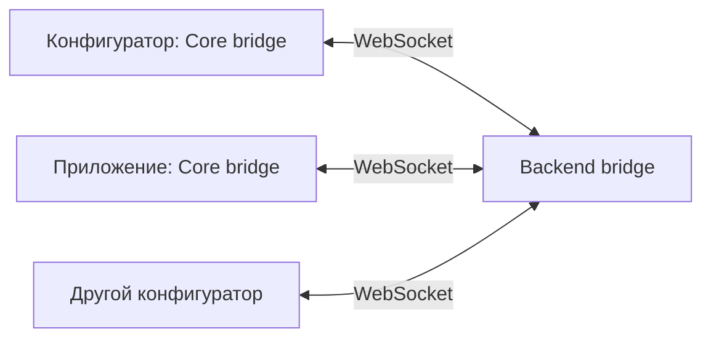

# Bridge: связь конфигуратора и приложения

`Endge.bridge` соединяет экземпляры Core через backend. Модуль позволяет
конфигуратору запросить отладочную сессию конечного приложения, получить его
полный диагностический снимок и отправить команду симуляции. Он также получает
список подключённых конфигураторов и уникальных пользователей рабочего пространства.

Модуль заменяет прежний `Endge.runtimeDebugger`, работавший через
`BroadcastChannel`. WebSocket через backend позволяет связывать приложения
с разными origin. Конечное приложение может использовать свой Keycloak и свой
источник Domain, включая локальный bundle: backend моста не становится его
поставщиком данных.

::: info Текущая версия
Симуляция пока **не выполняется**: клиент проверяет её наличие и hash, затем
пишет mock-сообщение в свою консоль. Список конфигураторов доступен через API
Core; готовых виджетов, привязки к странице и уведомлений о сохранении пока нет.
:::

## Как устроено соединение



На каждый разрешённый backend модуль открывает одно соединение. В нём работают
две возможности:

- `bridge.debug` — обнаружение приложений, согласование сессий и команды отладки;
- `bridge.configurator` — подключения конфигураторов и участники workspace.

Сам `bridge` управляет транспортом, переподключением и очисткой. Подмодули не
открывают дополнительные sockets. Backend выдаёт каждому подключению свой
`instanceId`; он меняется после переподключения.

## Настройка backend

Bridge по умолчанию выключен. Для dev-стенда задайте:

```dotenv
BRIDGE_ENABLED=true
BRIDGE_DEBUG_ENABLED=true
BRIDGE_ALLOWED_ORIGINS=https://config-dev.example.com,https://aodb-dev.example.com
```

`BRIDGE_ALLOWED_ORIGINS` содержит **origin браузерных приложений**, которым
разрешено подключаться. Это точные адреса со схемой и портом, без wildcard,
пути, credentials, query и fragment. Для локальной разработки добавьте
соответствующие `http://localhost:...` origins.

`BRIDGE_DEBUG_ENABLED=true` запрещён в production: backend отвергнет такую
конфигурацию при старте. Список конфигураторов может работать с
`BRIDGE_ENABLED=true` и выключенной отладкой.

Маршруты относительно настроенного backend base URL:

| Маршрут | Назначение |
| --- | --- |
| `/api/v1/bridge/configurator` | WebSocket с существующей аутентификацией конфигуратора |
| `/api/v1/bridge/client` | Регистрация конечного приложения для dev-отладки |

Конфигуратор должен предварительно войти на этот backend обычным способом.
Браузер передаёт его session cookie при WebSocket handshake. Политика cookies,
TLS, CSP `connect-src` и поддержка WebSocket Upgrade в reverse proxy должны
допускать выбранные адреса. Bridge не переносит cookie из другого backend
и не запрашивает токен Keycloak конечного приложения.

## Настройка конечного приложения

Разрешённые backend URL перечисляются через запятую:

```dotenv
VITE_ENDGE_BRIDGE_ALLOWED_SERVERS=https://backend-dev.example.com,http://localhost:8080
```

В отличие от серверного списка origins, здесь указаны **адреса backend**.
Если backend использует base path, включите его в URL:
`https://example.com/endge`. Суффикс `/api/v1/bridge/client` модуль добавит сам.

Приложение читает env и передаёт типизированную политику в свой обычный `boot`:

```ts
import { Endge, parseBridgeAllowedServers } from '@endge/core'

const allowedServers = parseBridgeAllowedServers(
  import.meta.env.VITE_ENDGE_BRIDGE_ALLOWED_SERVERS,
)

await Endge.boot({
  ...appBootOptions,
  // appBootOptions.scope.workspaceIdentity должен быть задан.
  bridge: allowedServers.length
    ? { role: 'client', allowedServers, debug: true, label: 'AODB Dev' }
    : undefined,
})
```

`appBootOptions` — существующие параметры загрузки приложения, включая источник
Domain и workspace. Этот пример дополняет его единственный boot, а не запускает
второй экземпляр Core. Стороны указывают один workspace identity; backend
проверяет доступ конфигуратора к нему.

Парсер обрезает пробелы, игнорирует пустые элементы и удаляет дубликаты после
нормализации. Невалидный URL вызывает ошибку конфигурации. Core сам не читает
`import.meta.env`. В Vite такие значения подставляются при сборке; для изменения
без пересборки host должен передать настройки из своего runtime config.

Если `bridge` отсутствует или `allowedServers` пуст, соединения не открываются.
`debug` по умолчанию false. На production-развёртывании конечного приложения
не передавайте разрешение отладки; dev-стенд может использовать production
build, поэтому `import.meta.env.DEV` не определяет политику стенда.

## Настройка конфигуратора

В его обычный boot передаётся выбранный backend:

```ts
await Endge.boot({
  ...configuratorBootOptions,
  bridge: {
    role: 'configurator',
    serverUrl: configuredBackendUrl,
    debug: true,
    label: 'Мой конфигуратор',
  },
})
```

Это opt-in API Core: приложение должно явно передать `bridge` в boot.
Установка новой версии Core сама по себе не включает соединение.
Для получения только списка конфигураторов опустите `debug`.

## Удалённая отладка в интерфейсе

В меню **Отладка → Удалённая отладка** откройте отдельную вкладку `/debugger`.
Она использует существующий вход разработчика на выбранный backend и workspace.
Выберите подключённое приложение в header. В AODB появится обычный диалог
подтверждения; после согласия и ответа сервера отладчик запросит снимок.

Общий Grid Layout размещает штатный виджет **Проект** со всеми документами
снимка и общую центральную область со Smart Tabs. Документы
открываются в общих редакторах Configurator, включая их внутренние вкладки,
в режиме просмотра. Изменение поля, Source или сохранение вызывает предупреждение.
Footer показывает workspace, tenant, project, environment, user и настройки
контекста клиента. Эти значения не переключают авторизацию разработчика.

При выборе другого клиента предыдущие документы и вкладки очищаются. Поздний
ответ старого клиента не заменяет новый снимок. Если приложение отключилось,
последний снимок остаётся доступным с явным статусом отключения; новое подключение
требует нового согласия. **Завершить сеанс** освобождает Bridge и закрывает вкладку.

В этой версии интерфейс не содержит Runtime Tree, управления симуляциями или
других команд Bridge. Приложение в обычной вкладке продолжает работать отдельно.

### Режим Core для inspection

`Endge.mode` возвращает `application` либо `debugger`; режим задаётся один раз
в boot context. Debugger запускает только владельцев Context, Workspace, Domain,
DomainRepository и Bridge. Внешний data provider не передаётся; compiler, Program,
runtime, renderer, integrations и дочерние Federations не активируются.

`Endge.replaceDebuggerSnapshot(snapshot)` принимает diagnostics snapshot v2,
проверяет Workspace/Context и материализует Domain обычными Core models. Затем
все коллекции заменяются целиком: это не merge с предыдущим приложением.
Вложенные entities, Maps и editor drafts защищены от записи; repository и
runtime entrypoints также проверяют режим. Context снимка и личное состояние
интерфейса debugger остаются в памяти вкладки.

В AODB настройка client Bridge уже подключена к общему boot для Vite mode
`development`. Задайте `VITE_ENDGE_BRIDGE_ALLOWED_SERVERS`; в остальных modes
эта интеграция отключена. Для локальной пары backend allowlist origins должен
содержать адреса Configurator и AODB с их портами.

## Начать сессию отладки

Получайте доступные приложения из `debug.clients`. Список обновляется при
регистрации и отключении клиентов; сразу после boot он может быть пустым.

```ts
const unsubscribe = Endge.bridge.debug.subscribe(() => {
  console.table(Endge.bridge.debug.clients)
})

// Вызывайте после выбора доступного клиента пользователем.
async function debugClient(client: { serverUrl: string; instanceId: string }) {
  const session = await Endge.bridge.debug.requestSession(client)

  try {
    const snapshot = await Endge.bridge.debug.getSnapshot(session.sessionId)
    console.log('Снимок приложения', snapshot)

    const identity = 'simulation-example'
    const expectedHash = await Endge.bridge.debug.getSimulationHash(identity)
    const result = await Endge.bridge.debug.runSimulation(session.sessionId, {
      identity,
      expectedHash,
    })
    console.log('Результат команды симуляции', result)
  }
  finally {
    if (Endge.bridge.debug.sessions.some(item => item.sessionId === session.sessionId)) {
      await Endge.bridge.debug.endSession(session.sessionId)
    }
  }
}

// При уничтожении consumer-а:
unsubscribe()
```

`requestSession()` завершится успешно только после подтверждения в конечном
приложении. В AODB используется компонент `BridgeConsent_Dialog` на стандартном
`Dialog`: он показывает пользователя, backend URL, workspace и разрешаемые
действия. Это обычный интерфейс страницы, поэтому он не зависит от блокировки
браузерного `confirm` в фоновой вкладке. Вернитесь в AODB и нажмите «Разрешить»
до истечения срока запроса.

Другой host отображает `Endge.bridge.debug.pendingConsent` своим компонентом и
передаёт ответ в `Endge.bridge.debug.respondToConsent(request, accepted)`.
Подписка — стандартный `Endge.bridge.debug.subscribe`. Core владеет сроком действия
и снимает запрос при timeout, отзыве сессии, disconnect/reset. UI не должен
копировать запрос в persistent state или автоматически давать согласие.
Отказ, отсутствие View и просроченный запрос не открывают диагностическую сессию.

Клиент принимает **одну сессию сразу для всех backend**. Пока диалог одного
сервера открыт, другой запрос не получает второе подтверждение. Переподключение
отзывает согласие: новую debug-сессию нужно запросить заново.

Backend допускает отладку для `editor`, workspace `admin` и `platform_admin`.
Роль `viewer` позволяет видеть участников workspace, но не список debug clients
и не получать снимки. Права, активность пользователя и отзыв browser session
проверяются повторно; heartbeat не продлевает аутентификацию.

### Команда симуляции

`getSimulationHash(identity)` читает локальную симуляцию конфигуратора и вычисляет
SHA-256 UTF-8 строки `JSON.stringify([sourceVersion, source])`. Клиент тем же
способом проверяет свою симуляцию из загруженного Domain. Имя и локальный ID
документа в hash не входят.

| Результат | Значение |
| --- | --- |
| `{ status: 'mocked', identity, hash }` | Симуляция найдена, source совпадает, сообщение выведено в консоль конечного приложения |
| `{ status: 'rejected', reason: 'not-found' }` | Симуляции нет в загруженном Domain клиента |
| `{ status: 'rejected', reason: 'hash-mismatch' }` | Source/version отличаются либо изменились во время проверки |

Ошибки доступа, разрыв соединения и таймаут отклоняют Promise. Команда не
передаёт Source, не импортирует отсутствующий документ и не выполняет его код.
Совпадение hash не подтверждает совпадение зависимостей или окружения.

### Полный диагностический снимок

`getSnapshot()` использует [существующий сборщик диагностики](./diagnostics)
с включёнными telemetry, problems, configuration, effective configuration,
Domain, Program, Runtime, Raph data и Raph graph. Сохраняются redaction и
`captureErrors`. Локальный файл не скачивается, configured outputs не вызываются.
Снимок отражает текущее сохранённое диагностическое состояние, а не бесконечную
историю работы приложения.

Внутри Core debug-подмодуль вызывает `Endge.domain.getSimulationByIdentity()` и
`Endge.diagnostics.snapshot()` напрямую. Полный состав снимка задаёт
`BRIDGE_SNAPSHOT_OPTIONS` в конфигурации Bridge. Передавать aliases или callbacks
этих методов при создании `EndgeBridge_Module` не нужно; host задаёт только
параметры `bridge` в `Endge.boot()`.

Размер сообщения ограничен 16 MiB. Слишком большой snapshot даёт ошибку;
модуль не обрезает его незаметно. При недоступном клиенте запрос завершится
ошибкой, а не будет воспроизведён после reconnect.

## Подключённые конфигураторы

```ts
const unsubscribe = Endge.bridge.configurator.subscribe(() => {
  console.table(Endge.bridge.configurator.connections)
  console.table(Endge.bridge.configurator.participants)
})
```

`connections` содержит `serverUrl`, `instanceId`, `userId`, `displayName` и `label`.
Каждая вкладка — отдельное подключение. `participants` объединяет вкладки по
`serverUrl + userId` и добавляет `connectionCount`. Текущий пользователь включён
в список; если нужен счётчик «с вами ещё N», consumer исключает себя.

Список относится к выбранному workspace и не фильтруется по странице.
Конечные приложения не учитываются как конфигураторы. Неаутентифицированный
debug client не получает roster с именами пользователей. При потере backend
его локальные списки очищаются и после reconnect загружаются заново.

## API и жизненный цикл

| API | Назначение |
| --- | --- |
| `bridge.connections` | Состояния соединений, server URL, текущий instanceId и ошибка подключения |
| `bridge.connect(serverUrl)` | Подключить разрешённый backend после явного disconnect |
| `bridge.disconnect(serverUrl)` | Отключить backend и остановить reconnect |
| `bridge.debug.clients` | Доступные dev-приложения |
| `bridge.debug.sessions` | Активные согласованные debug-сессии |
| `bridge.debug.requestSession({ serverUrl, instanceId })` | Запросить согласие клиента |
| `bridge.debug.endSession(sessionId)` | Завершить сессию с любой стороны |
| `bridge.debug.getSimulationHash(identity)` | Получить hash локального source |
| `bridge.debug.runSimulation(sessionId, { identity, expectedHash })` | Проверить и залогировать mock на клиенте |
| `bridge.debug.getSnapshot(sessionId)` | Получить полный snapshot |
| `bridge.configurator.connections` | Вкладки конфигураторов workspace |
| `bridge.configurator.participants` | Уникальные пользователи по каждому backend |

`bridge`, `debug` и `configurator` используют обычный `subscribe()` Modules;
consumer обязан вызвать возвращённый disposer. Transport стартует в lifecycle
`start` внутри `Endge.boot()`. Вызывать фазовые методы вручную не требуется.
`Endge.reset()` освобождает bridge вместе с остальными Modules.

Сервер отправляет protocol Ping каждые 15 секунд и закрывает socket после
60 секунд без Pong. Браузер отвечает на protocol Ping самостоятельно: это
проверка соединения, а не активности пользователя или готовности JavaScript.
Дополнительно backend отправляет маленькое `heartbeat`-сообщение каждые 15 секунд.
Если Core не получает сообщений 75 секунд, он отзывает локальную сессию и
переподключается. Фоновая вкладка может обработать этот таймаут позже, когда
браузер возобновит JavaScript.
Регистрация ограничена 10 секундами, согласие и ответ клиента — 45 секундами
на сервере; клиентский запрос имеет предел 60 секунд. Сессия отладки ограничена
30 минутами и может закончиться раньше при истечении аутентификации.

При временном обрыве модуль повторяет подключение с задержкой от 1 до 30 секунд
и небольшим случайным разбросом. `disconnect`, `reset` и уход со страницы
останавливают попытки. Восстановление страницы через `pageshow` возобновляет
разрешённые соединения, но не согласие на отладку.

Backend ограничивает число соединений, частоту сообщений и очереди отправки.
Close, ошибка, timeout и shutdown освобождают sockets, goroutines, участников
и связанные requests. Состояние хранится в памяти одного процесса: общая
таблица участников нескольких backend-реплик в этой версии не поддерживается.

## Переход с runtimeDebugger

Удалите обращения к `Endge.runtimeDebugger.startListening()`, `activate()` и
ручному `runtimeDebugger.reset()`. Передайте optional `bridge` в существующий
boot, используйте API выше и оставьте lifecycle корневому Core. Старый
`BroadcastChannel` и определение роли через `/admin` больше не используются.
