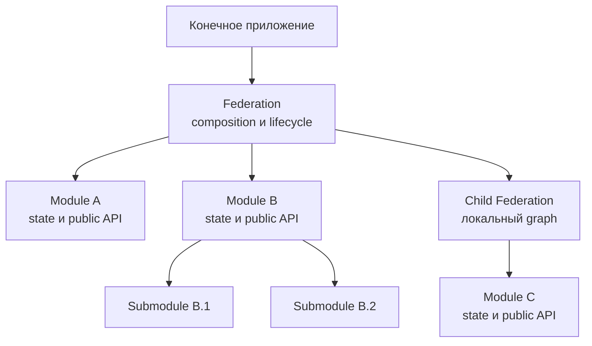
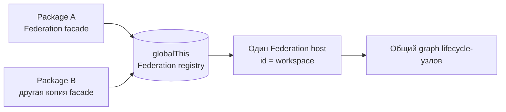

# Federation

Federation — расширяемая модель композиции runtime-возможностей Endge. Она
объединяет Modules и дочерние Federations, задаёт их порядок и проводит всё дерево
через общий lifecycle.
Приложение может использовать готовую Federation, определить собственную или
скомпоновать несколько независимых Federations.

Federation не обязательна для каждой feature. Она оправдана, когда функциональный
блок владеет несколькими Modules, общим lifecycle или orchestration. Простая
stateless-утилита и feature без такого владельца остаются обычным functional root.

## Модель расширения

Federation управляет только явно объявленными lifecycle-узлами своего graph.
Дочерняя Federation является одним composite-узлом и сама управляет собственным
локальным graph. Если Module состоит из submodules, он сам создаёт их, открывает
через public API и передаёт им lifecycle. Reflection по полям владельцев нет.

## Runtime identity и singleton

Federation используется как статический facade, но её изменяемое runtime-состояние
хранится в общем host. Host определяется не именем TypeScript-класса, а стабильным
`federationId`.

Несколько copies одного package в одном JavaScript realm получают общий host,
если используют одинаковый `federationId`. Это предотвращает дублирование
Modules и lifecycle в конечном приложении.

::: warning Runtime-граница
Singleton действует в пределах одного JavaScript realm — конкретного
`globalThis`. Другая browser-вкладка, Worker, iframe с отдельным realm или другой
Node.js process имеет собственный registry.
:::

## Контракт identity

- `id` — стабильная runtime identity Federation;
- `name` — отображаемое имя для diagnostics и сообщений;
- один `id` соответствует одному structural graph;
- независимые Federations используют разные ids;
- разные декларации с одинаковым id не должны описывать разные наборы lifecycle-узлов.

Коллизия ids не создаёт второй host: определения начинают разделять состояние,
а первая выполненная конфигурация определяет graph. Поэтому id должен быть
глобально уникальным внутри приложения и сохраняться между versions Federation.

## Дальше

1. Выберите [структуру feature](./functional-structure).
2. Определите ownership [Modules и submodules](./modules).
3. Соберите Federation через [`EndgeFederation.define(...)`](./defining-federation).
4. При необходимости подключите [дочерние Federations](./federation-composition).
5. Для внешнего package экспортируйте [декларативное расширение](./federation-extensions).
