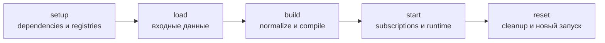

# Modules и submodules

Module — владелец связного runtime-состояния, public API и lifecycle одной
ответственности. Federation координирует корневые Modules, но не переносит их
business logic в собственный class.

## Lifecycle Module

Module может участвовать в пяти фазах:



- `setup` подготавливает dependencies, clients и registries;
- `load` принимает или загружает принадлежащие Module данные;
- `build` нормализует, валидирует, индексирует и компилирует;
- `start` запускает subscriptions, watchers и живую инфраструктуру;
- `reset` освобождает ресурсы и возвращает Module в повторно запускаемое состояние.

Module переопределяет только необходимые методы. Federation проводит корневые
Modules через общий pipeline и учитывает их `before`/`after` ordering.

## Диагностический snapshot

Каждый Module наследует `createDiagnosticsSnapshot()`. По умолчанию метод
возвращает результат `serialize()`, поэтому уже сериализуемое состояние
автоматически попадает в общий снимок без дополнительной регистрации:

```ts
export class Feature_Module extends EndgeModule {
  public override serialize(): FeatureState {
    return this.state
  }
}
```

Если persistence-проекция недостаточна или содержит данные, которые нельзя
передавать в поддержку, Module переопределяет именно диагностический метод:

```ts
export class Runtime_Module extends EndgeModule {
  public override createDiagnosticsSnapshot() {
    return {
      hosts: this.hosts.snapshot(),
      scopes: this.scopes.snapshot(),
      operations: this.operations.createDiagnosticsSnapshot(),
    }
  }
}
```

Root Federation рекурсивно обходит свой декларативный graph и дочерние
Federations. Для каждого узла сохраняются federation path, key, имя Module и
статус `captured`, `empty`, `skipped`, `failed` или `referenced`. Ошибка одного
Module записывается в его узле и не отменяет остальные снимки.

`createDiagnosticsSnapshot()` не является контрактом восстановления. Метод
возвращает inspectable JSON-safe проекцию текущего состояния; `serialize()` и
`deserialize()` продолжают принадлежать persistence owner и его versioned schema.
Module с credential-данными обязан вернуть безопасную проекцию или `undefined`.

## Submodule

Submodule является полноценным Module, но его owner — родительский Module, а не
Federation.

Родитель:

- явно создаёт submodules;
- предоставляет доступ к ним через собственный public API;
- вызывает их lifecycle в своих lifecycle methods;
- выполняет cleanup в безопасном, обычно обратном, порядке;
- включает их snapshots в собственную persistence schema, если persistence нужна;
- включает их диагностические snapshots в собственный
  `createDiagnosticsSnapshot()`, если состояние потомков нужно видеть в общем
  снимке.

```ts
export class Diagnostics_Module extends EndgeModule {
  public readonly telemetry = new Telemetry_Module()
  public readonly problems = new Problems_Module()

  public override async start(): Promise<void> {
    await this.telemetry.start()
    await this.problems.start()
  }

  public override async reset(): Promise<void> {
    await this.problems.reset()
    await this.telemetry.reset()
  }
}
```

Federation не обнаруживает submodules через reflection и не обходит поля Module.
Порядок lifecycle и состав диагностического snapshot потомков являются явным
контрактом родителя.

## State и persistence

Federation не сохраняет Module state автоматически. Persistent Module сам владеет:

- storage contract или специализированным persistence Service;
- snapshot schema и её versioning;
- моментом сохранения;
- порядком восстановления собственных submodules.

Локальный UI-state остаётся в компоненте, если он не должен переживать lifecycle
компонента. Он становится состоянием Module только при наличии общего owner и
реального runtime-сценария.
