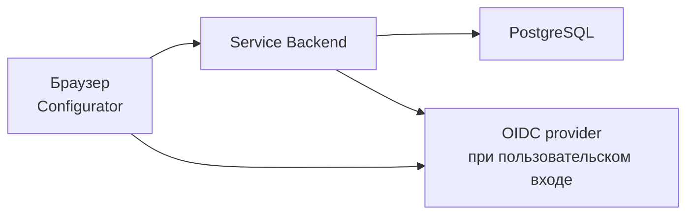

# Установка

Минимальная установка состоит из frontend конфигуратора, Service Backend и PostgreSQL. Backend отвечает за хранение данных и проверку доступа; frontend обращается к его HTTP API.



OIDC provider требуется для пользовательского входа. Для изолированной локальной разработки предусмотрен [режим dev](./authentication/development).

## Подготовка

Используйте совместимые версии [backend](https://github.com/endge-lab/service-backend) и [frontend](https://github.com/endge-lab/configurator). Требуемая версия Go указана в `go.mod` backend, а версии Node.js и pnpm — в `engines` и `packageManager` файла `package.json` frontend.

Для запуска из исходников понадобятся Git, Go, Node.js, pnpm, Make и доступная PostgreSQL с отдельной базой для Endge. У пользователя базы должны быть права на создание таблиц при выполнении миграций. Для команды `make migrate-up` нужен CLI `goose` совместимой с backend версии; зависимость указана в его `go.mod`.

Пример использует backend на `http://localhost:8080` и frontend на `http://localhost:5173`. Если выбираете другие адреса, согласованно замените их в конфигурации обоих компонентов.

## Backend

Получите исходники и создайте локальную конфигурацию:

```bash
git clone https://github.com/endge-lab/service-backend.git
cd service-backend
cp .env.development.example .env.development
```

В `.env.development` настройте соединение с подготовленной PostgreSQL:

| Переменная | Значение для вашей установки |
| --- | --- |
| `POSTGRES_HOST`, `POSTGRES_PORT` | Адрес и порт PostgreSQL |
| `POSTGRES_USER`, `POSTGRES_PASSWORD` | Учётные данные пользователя базы |
| `POSTGRES_DATABASE` | Имя отдельной базы Endge |
| `POSTGRES_SCHEMA` | Схема, обычно `public` |
| `POSTGRES_SSLMODE` | Режим TLS, соответствующий серверу PostgreSQL |

Задайте адреса приложения и разрешённый origin браузера:

```dotenv
APP_ENV=development
HTTP_PORT=8080
PUBLIC_URL=http://localhost:8080
CORS_ALLOWED_ORIGINS=http://localhost:5173
AUTH_RETURN_URL=http://localhost:5173
AUTH_ALLOWED_RETURN_ORIGINS=http://localhost:5173
AUTH_COOKIE_SECURE=false
AUTH_COOKIE_SAME_SITE=lax
```

Если в исходном env-файле задан `REST_PORT`, согласуйте его с `HTTP_PORT` или удалите: `REST_PORT` имеет приоритет. Для этого примера `HTTP_BASE_PATH` должен быть пустым. Адреса `localhost` и `127.0.0.1` не взаимозаменяемы при настройке origin и cookie.

Настройте [dev identity](./authentication/development) для локального знакомства либо [OIDC](./authentication/oidc) для входа через провайдера. Не полагайтесь на значение режима по умолчанию.

Backend требует ключ шифрования даже в dev-режиме. Сгенерируйте 32 случайных байта, представьте их в Base64 и сохраните как `ENCRYPTION_KEY`; задайте идентификатор `ENCRYPTION_KEY_ID`, например `v1`. Храните ключ вне Git и сохраняйте между перезапусками: от него зависит чтение зашифрованных сессий и credentials. В production передавайте его через механизм секретов вашей инфраструктуры.

Для базовой установки оставьте пустыми `AI_WORKBENCH_GRPC_TARGET` и `MOCK_GENERATOR_GRPC_TARGET`. Не включайте интеграции с сервисами, которые ещё не развёрнуты.

Примените миграции и запустите backend:

```bash
make migrate-up
make run
```

`make migrate-up` меняет указанную базу данных. Команды выполняются после настройки её адреса и credentials. Проверьте `http://localhost:8080/health` и `http://localhost:8080/version`: они должны отвечать от запущенного backend. Это проверка доступности сервиса, а не успешного пользовательского входа.

## Frontend

В другом терминале получите исходники frontend:

```bash
git clone https://github.com/endge-lab/configurator.git
cd configurator
pnpm install --frozen-lockfile
```

Создайте `.env.local`:

```dotenv
VITE_ENDGE_SERVICE_BACKEND_URL=http://localhost:8080
```

Этот адрес должен быть доступен браузеру. Адрес контейнера во внутренней Docker-сети для него не подходит.

Запустите frontend с фиксированным портом, который уже указан в CORS backend:

```bash
pnpm dev --port 5173 --strictPort
```

Откройте `http://localhost:5173`. При первом запуске выберите рабочую среду, даже если backend только один. Затем войдите, если выбран OIDC, и выберите доступное рабочее пространство. Порядок промежуточных экранов зависит от сохранённой сессии и выбранной среды.

## Публикация frontend и запуск бинарника

Frontend собирается командой `pnpm build`. Размещайте каталог `dist` на HTTP-сервере с возвратом `index.html` для клиентских маршрутов. `VITE_ENDGE_SERVICE_BACKEND_URL` задаётся при сборке; изменение переменной в окружении уже запущенного статического сервера не переписывает bundle.

Backend собирается командой `make build`; по умолчанию бинарник создаётся как `tmp/service-backend`. Передайте ему runtime-конфигурацию и ключ шифрования, обеспечьте соединение с PostgreSQL и применение миграций. Для production задайте `APP_ENV=production` и используйте [OIDC](./authentication/oidc).

При работе через префикс пути согласуйте `HTTP_BASE_PATH`, `PUBLIC_URL`, адрес frontend до backend и `AUTH_REDIRECT_URL`. Например, для `HTTP_BASE_PATH=/endge-service-backend` callback находится по пути `/endge-service-backend/auth/callback`.

Для HTTPS-развёртывания используйте secure cookie. Если frontend и backend находятся на разных сайтах, дополнительно согласуйте `SameSite`, CORS с credentials и ограничения браузера на сторонние cookie. Размещение под одним сайтом упрощает эту настройку.

## Проверка установки

1. Backend отвечает на `/health` и `/version`.
2. Frontend обращается к правильному backend без ошибок CORS.
3. Вход завершается возвратом в конфигуратор, а обновление страницы сохраняет сессию.
4. Пользователь видит ожидаемые workspace и может выполнять разрешённые своей ролью действия.
5. В локальном режиме администратор может открыть управление доступом.

::: warning Проект внешних прав
Файл `endge-access.yaml` и внешний режим диалога ещё не реализованы. Их будущая настройка описана в [отдельном проекте конфигурации](./authentication/access-configuration). Наличие этого файла пока не меняет поведение существующего backend.
:::
