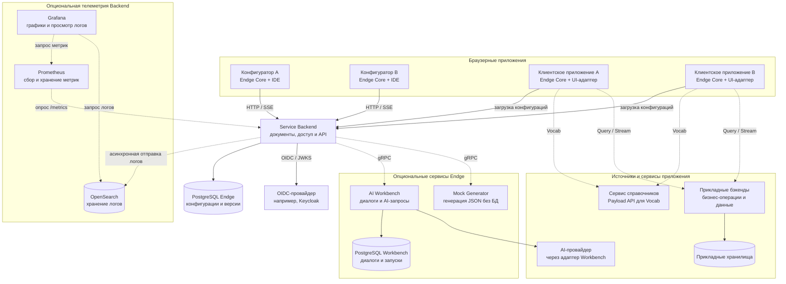

# Архитектура экосистемы

Endge может объединять несколько конфигураторов, клиентских приложений и серверных сервисов. Общая конфигурационная модель связывает эти части, а каждая из них сохраняет собственную ответственность: редактирование, хранение документов, исполнение сценариев, работу с прикладными данными или авторизацию.

Ниже показан расширенный состав экосистемы. Для начала работы достаточно конфигуратора, Service Backend и PostgreSQL; OIDC-провайдер подключается для пользовательского входа. AI Workbench, Mock Generator и внешние источники данных добавляются по потребности.

## Общая схема

Стрелка направлена от инициатора обращения к его получателю; ответы не нарисованы отдельно. Пунктиром обозначены подключения, которые нужны только при использовании соответствующей возможности. Приложения могут получать конфигурации из подготовленного bundle вместо загрузки с Backend.

Телеметрия подключается отдельно: Prometheus собирает метрики Backend, OpenSearch хранит его логи, а Grafana показывает оба источника. Недоступность этих сервисов не блокирует запуск Backend и обработку запросов.

Для крупной схемы используйте кнопку полноэкранного просмотра в её правом верхнем углу.

Схема показывает логические компоненты. Несколько конфигураторов могут быть вкладками разных участников, экземплярами одной frontend-сборки или отдельными установками. Узлы PostgreSQL обозначают разные области хранения; их можно разместить на одном сервере БД с отдельными базами и доступами.

## Конфигураторы и клиентские приложения

**Конфигуратор** — браузерная среда работы с документами. Несколько участников могут обращаться к одному Backend и работать с доступными им Workspace, фасетами и вариантами контекста. Backend остаётся владельцем хранения и серверной проверки доступа. Общий сервер не означает совместное редактирование одного текста в реальном времени: сохранение документов использует revisions и обработку конфликтов.

**Клиентское приложение** — интерфейс для конечного пользователя. Оно включает собственную оболочку, Endge Core и совместимые реализации компонентов и операций. Core подготавливает и исполняет конфигурации внутри этого приложения. UI-адаптер связывает runtime с выбранным способом отображения.

Core — библиотека внутри приложения, поэтому отдельного обязательного сервера Core на схеме нет. В Runtime Preview конфигуратора также работает собственный runtime; он не является общим живым состоянием всех клиентов.

Клиент получает описание через поддерживаемый источник: например, HTTP API Backend или поставленный bundle. После загрузки прикладные запросы направляются в сервисы, указанные конфигурацией и адаптерами. Service Backend не становится обязательным посредником для каждой бизнес-операции.

## Service Backend и PostgreSQL

Service Backend предоставляет API для конфигураторов и совместимых потребителей. Он хранит Workspace и документы конфигурационной модели, обслуживает revisions, проверяет права и управляет серверными операциями над этими данными.

Основная PostgreSQL принадлежит Backend. Конфигураторы, браузерные клиенты и AI Workbench не обращаются к её таблицам напрямую. Изменения конфигураций проходят через API и правила Backend.

Прикладные данные — например, заявки, расписания или заказы — могут храниться в собственных сервисах и базах приложения. Их описание в Endge не переносит автоматически сами записи в PostgreSQL конфигуратора.

## Авторизация через OIDC

Keycloak — один из вариантов внешнего OIDC-провайдера. Он отвечает за подтверждение личности и выдачу токенов, а Backend проверяет пользовательскую сессию и разрешает операции в Endge.

При браузерном входе пользователь проходит перенаправление на страницу провайдера и возвращается через callback Backend. Линия Backend → OIDC на общей схеме объединяет серверные взаимодействия входа и проверки токенов. Обращение к провайдеру не выполняется заново для каждого прикладного запроса: проверка JWT использует кеш ключей JWKS.

Права Endge могут управляться локально либо формироваться из проверенных атрибутов провайдера по настроенной политике. Клиентские приложения и их API могут иметь собственные OIDC-настройки и профили доступа. Общий провайдер не означает одинаковые полномочия во всех сервисах.

Внутренние gRPC-вызовы используют сервисную identity Backend. Пользовательский access token не передаётся в Workbench и Mock Generator. Подробности пользовательского входа приведены в разделе [«Аутентификация»](/configurator/authentication).

## Опциональный AI Workbench

AI Workbench обрабатывает AI-диалоги и обращения к моделям. Конфигуратор отправляет запрос в Backend; Backend проверяет доступ, подготавливает снимок Workspace и вызывает Workbench по gRPC.

Workbench использует собственную PostgreSQL для диалогов, сообщений и запусков, а также подготовленный bundle документации. Он обращается к AI-провайдеру через совместимый адаптер. Конкретные возможности зависят от подключённой реализации провайдера.

Основная база Endge остаётся за границей Workbench. Сервис не применяет изменения к конфигурационному домену напрямую. Без Workbench базовое редактирование и хранение конфигураций остаются доступны. Подробнее — [подготовка данных в AI Workbench](/services/ai-workbench/data-preparation).

## Опциональный Mock Generator

Mock Generator создаёт JSON по поддерживаемой JSON Schema и может выдавать последовательность наборов данных. Внешний HTTP/SSE API принадлежит Backend: он проверяет пользователя и Workspace, вызывает генератор по gRPC и передаёт результат клиенту.

Генератор работает без PostgreSQL, Redis и брокера сообщений. Он отвечает за генерацию и жизненный цикл временных сессий, а Backend — за доступ и сопровождение обращений.

Этот сервис дополняет инструменты проверки приложения, но сам не исполняет конфигурации Endge. Подключение генератора к Backend не означает автоматической подмены всех Query или готовности запуска Simulation. Доступные способы проверки описаны в [единой среде работы](/getting-started/shared-workspace#проверка-на-тестовых-данных).

## Сервис справочников и прикладные бэкенды

На схеме **сервис справочников** обозначает внешний источник записей, используемый Vocab. В текущем контракте Vocab поддерживает Payload-provider: документ описывает адрес и коллекцию, а runtime читает данные через совместимый API и применяет преобразования.

Vocab-документ хранится в конфигурационной модели, а записи справочника принадлежат внешнему источнику. Его БД и способ развёртывания определяются самим сервисом. Отдельный реализованный Endge Vocab Service в текущий состав сервисов не входит; на схеме показана доступная интеграция с внешним источником, а не обещание готового нового сервиса.

Прикладные бэкенды предоставляют остальные данные и операции через Query, Stream и подключённые адаптеры. Аналогичные обращения могут выполняться из Runtime Preview конфигуратора; на общей схеме показаны основные связи клиентских приложений, чтобы не дублировать каждую линию.

## Основные пути взаимодействия

| Сценарий | Путь |
| --- | --- |
| Сохранить конфигурацию | Конфигуратор → Backend → PostgreSQL Endge |
| Загрузить модель в клиент | Клиент → Backend либо поставленный bundle |
| Получить прикладные данные | Runtime клиента → адаптер → прикладной API |
| Прочитать справочник | Vocab runtime → Payload API внешнего источника |
| Выполнить AI-запрос | Конфигуратор → Backend → Workbench → AI-провайдер |
| Сгенерировать тестовые данные через API | Авторизованный клиент → Backend → Mock Generator |
| Получить удалённую диагностику | Конфигуратор → Backend Bridge → согласованная сессия клиентского приложения |

[Bridge](/advanced/bridge) использует WebSocket для связи экземпляров Core через Backend. Его диагностика подключается отдельно от обычного получения конфигураций и прикладных данных.

## Как выбрать состав установки

Для знакомства начните с конфигуратора, Backend и PostgreSQL по [инструкции установки](/configurator/installation). Для пользовательского входа подключите OIDC. Затем добавляйте необходимые клиентские приложения, источники данных и дополнительные сервисы.

Микросервисный состав позволяет независимо развивать компоненты, но конкретная установка не обязана включать все узлы схемы. Число frontend-экземпляров также не определяет число backend-реплик. Горизонтальное масштабирование серверов требует отдельной проверки состояния и транспорта; например, текущие Bridge-сессии хранятся в памяти процесса Backend.

Дальше: [как работает Endge внутри приложения](/getting-started/how-endge-works) и [как команда работает с конфигурациями](/getting-started/shared-workspace).
