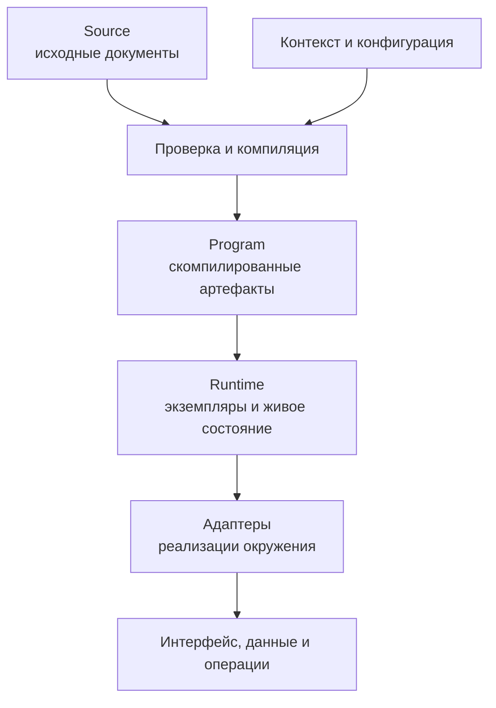
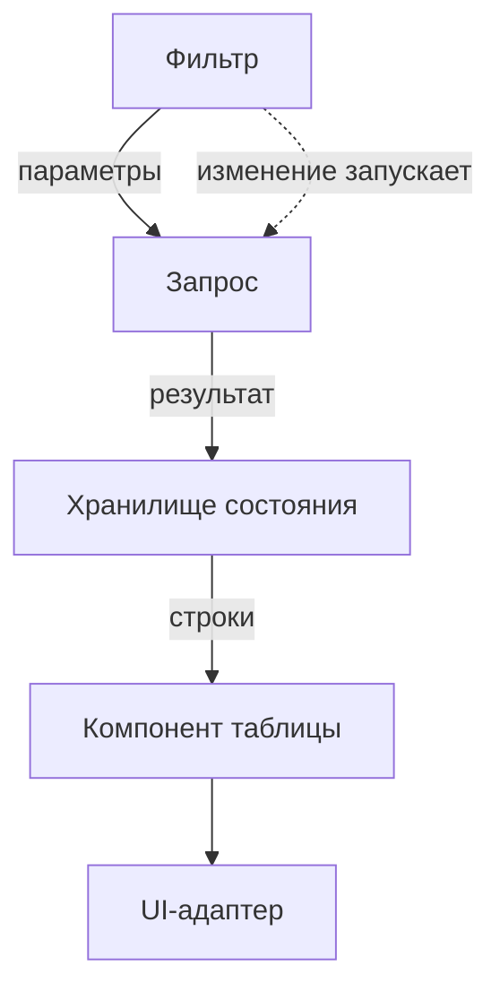
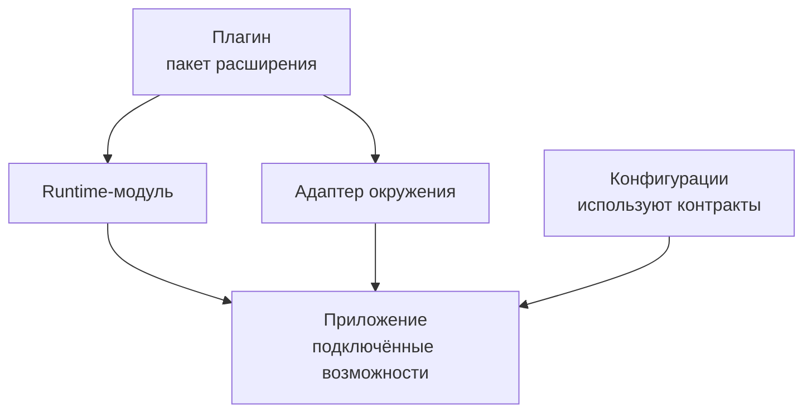

# Как работает Endge

Endge превращает конфигурационные документы в программу, которая работает внутри приложения через совместимые runtime-модули и адаптеры. Разработчик описывает состав и связи, а прикладной код предоставляет конкретные реализации возможностей.

На этой странице показан путь конфигурации от редактирования до исполнения. Общая концепция и аудитория описаны на странице [«Что такое Endge»](/).

## От Source к работающему приложению

У каждого этапа собственная ответственность. Source хранит авторское описание, Program — результат компиляции, Runtime — состояние конкретного исполнения. Адаптеры связывают исполнение с возможностями окружения.

## Source: документы и связи

Разработчик создаёт документы для нужного сценария: например, Query, Store, Component SFC и Composition. Каждый документ описывает свою часть поведения через предусмотренный контракт.

Source редактируется текстом или поддерживаемым визуальным редактором. Визуальная правка изменяет то же исходное описание; отдельная независимая модель поведения для визуального режима не создаётся.

DSL Endge — специализированный язык конфигураций. Его выражения компилируются в поддерживаемые операции. Произвольный императивный код подключается через реализации приложения и разрешённые точки расширения, а не исполняется непосредственно из Source.

Сохранение документа фиксирует его описание. Само по себе оно не запускает запросы, не создаёт пользовательский интерфейс и не меняет внешнее хранилище.

## Контекст: какой вариант конфигурации используется

Контекст связывает запуск с рабочим пространством, организацией, проектом и окружением:

- **Workspace** — рабочее пространство команды;
- **Tenant** — организация или заказчик;
- **Project** — прикладной проект;
- **Environment** — окружение выполнения.

Эти уровни участвуют в разрешении effective configuration. Слои применяются в порядке `Workspace → Tenant → Project → Environment`; поддерживаемые правила наследования и замены описаны в [справочнике Configuration](/reference/configuration).

Компилятор получает согласованный build context. Изменение значимых для сборки настроек требует обновления соответствующих артефактов: результат, подготовленный для другого контекста, нельзя незаметно использовать как актуальный.

Так можно поддерживать общие настройки и явные различия между запусками. Набор доступных переопределений определяется контрактами документов и модулей; наличие контекста не означает автоматическое преобразование любой бизнес-модели под заказчика.

## Компиляция: проверка до исполнения

Компилятор разбирает Source, проверяет поддерживаемый синтаксис и строит подготовленное представление. Для соответствующих типов документов он проверяет ссылки, зависимости и совместимость контрактов, формирует операции и публикует артефакты в Program.

Важно различать:

| Слой | Что в нём находится |
| --- | --- |
| **Source** | Исходное описание, которое редактирует и сохраняет команда |
| **Program** | Скомпилированные артефакты, зависимости и диагностика |
| **Runtime** | Экземпляры исполнения, текущие данные и ресурсы |

Перед обычным запуском сохранённого source-first документа требуется актуальный валидный артефакт. Отсутствующая, ошибочная или устаревшая программа останавливает запуск с диагностикой.

Черновик редактора может проверяться в отдельном preview-контексте. Такой результат не заменяет автоматически сохранённый документ или действующую программу приложения.

## Runtime: исполнение и состояние

Runtime создаёт экземпляры из подготовленной программы. Они владеют текущим состоянием, подписками, запросами и другими ресурсами своего запуска.

Composition собирает runtime-узлы и определяет их взаимодействие. Например, сценарий загрузки таблицы можно представить так:

Сплошные связи передают значения или результат следующему участнику. Пунктирная связь обозначает условие запуска. Новое значение параметра и команда выполнить запрос — разные части контракта Composition.

В этом сценарии Composition определяет запуск и связи, Query выполняет запрос через транспортную реализацию, Store содержит состояние, а UI-адаптер отображает компонент. При завершении соответствующего runtime-scope освобождаются принадлежащие ему ресурсы.

Состояние одного запуска не становится частью исходной конфигурации. Несколько потребителей одной модели могут иметь независимые данные и жизненные циклы.

## Адаптеры: связь с окружением

Адаптер реализует конкретный контракт средствами целевой среды. Это может быть отображение компонента, обращение к внешнему сервису, хранение данных или другая поддерживаемая операция.

Ядро и runtime-модули определяют смысл исполнения. Адаптер отвечает за технологические детали в пределах своего контракта. Например, UI-адаптер получает подготовленное состояние и передаёт события, но не создаёт параллельную бизнес-логику или собственный порядок выполнения Composition.

Чтобы заменить адаптер без изменения общей конфигурации, новая реализация должна поддерживать используемые возможности и сохранять их семантику. Специфические функции окружения требуют явных расширений и проверки совместимости.

Runtime без интерфейса не нуждается в UI-адаптере, если используемые операции поддерживают такое исполнение. Для другого языка или среды требуется совместимая реализация потребителя или runtime; переносимость документов сама по себе её не создаёт.

## Плагины: подключение возможностей

Плагин поставляет реализации, которые приложение подключает через опубликованные точки расширения. Он может объединять несколько Modules, адаптеров и прикладных возможностей. Конфигурационные документы используют их публичные контракты.

Это схема состава расширения, а не последовательность его динамической установки. В текущем Core доверенный `EndgePlugin` регистрируется до boot; lifecycle подключённых Modules и Federations управляет их подготовкой, запуском и освобождением ресурсов. Подробности — в [контракте расширений Federation](/advanced/federation-extensions).

Расширяемая среда может также предоставлять редакторы, средства проверки и библиотеки для других потребителей конфигураций. Для каждой такой возможности нужен собственный поддерживаемый путь интеграции. Механизм `EndgePlugin` сам по себе не устанавливает runtime в другой сервис и не добавляет произвольный новый тип документа во все слои платформы.

## Поставка и использование в нескольких приложениях

Команда фиксирует изменения и выпускает согласованную версию конфигураций. Приложение может получать описания из доступного источника или поставленного bundle и подготавливать их к исполнению через свой поддерживаемый путь загрузки и компиляции.

Release конфигураций и Program — разные результаты. Release фиксирует переносимое описание, а Program содержит артефакты, подготовленные конкретным compiler path для исполнения. Нельзя считать их взаимозаменяемыми форматами.

Каждое приложение или сервис использует необходимую ему часть общих контрактов. В расширенной модели платформы потребитель может получать исходные документы либо целевой артефакт, если для такого способа поставки реализован совместимый контракт.

Версии документов и реализаций согласуются явно. Общая точка разработки конфигураций не требует постоянного обращения к IDE во время каждой операции и не объединяет runtime-состояние разных процессов.

## IDE и диагностика

Конфигуратор помогает проследить путь от исходного документа к выполнению:

- отредактировать Source и проверить связи;
- увидеть ошибки компиляции и подготовленный артефакт;
- запустить поддерживаемый preview-сценарий;
- исследовать runtime-узлы, данные и диагностику;
- сохранить изменения и подготовить версию конфигураций к поставке.

При анализе ошибки полезно определить её слой: исходное описание, контекст, компиляция, исполнение или реализация адаптера. Это помогает менять именно ту часть системы, которая отвечает за наблюдаемое поведение.

## Что дальше

1. [Модули конфигуратора](/configurator/modules) — где и как команда работает с проектом.
2. [Сущности Endge](/domain/entities) — из каких документов состоит модель.
3. [Жизненный цикл документа](/domain/lifecycle) — как изменения проходят через систему.
4. [Синтаксис и контракты](/reference/query) — как описывать отдельные механизмы.
5. [Federation](/advanced/) — как организовать модули и расширения приложения.
