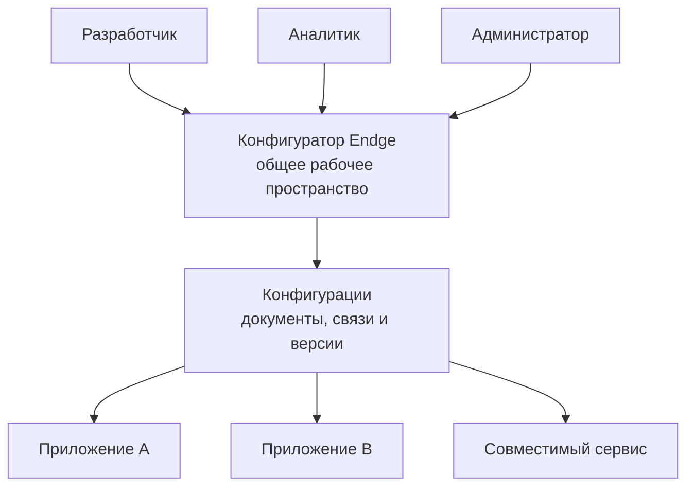
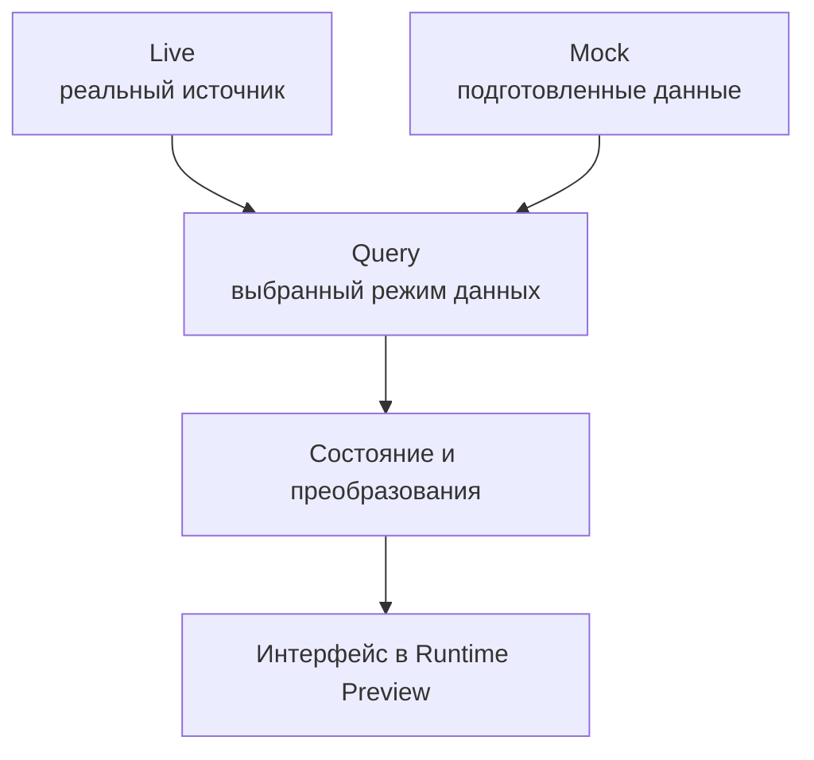

# Единая среда работы

Конфигуратор Endge объединяет работу с конфигурационной моделью: от редактирования документов и настройки окружения до проверки связей и исследования исполнения. Команда получает общее рабочее пространство для тех частей экосистемы, которые используют поддерживаемые конфигурации Endge.

## Общая модель для разных участников

В разработке и сопровождении приложения участвуют люди с разными задачами. Разработчик отвечает за программные возможности, аналитик — за описание и проверку прикладного сценария, администратор — за разрешённые настройки и доступ. Общая модель помогает связывать эту работу: участники обсуждают одни и те же документы, зависимости и результаты.

| Участник | Работа с моделью |
| --- | --- |
| **Разработчик** | Подключает компоненты, операции и адаптеры; описывает сложное поведение; исследует диагностику |
| **Аналитик** | Уточняет состав сценария, данные и связи; готовит примеры и проверяет результат через доступные редакторы и preview |
| **Администратор** | Управляет доступными ему настройками, окружениями и подключениями в пределах своих полномочий |

Это распределение задач команды. Названия профессий не обозначают готовые профили прав или отдельные интерфейсы: конкретный набор операций определяется разрешениями и средствами редактирования. Для конфигураций, которым пока требуется текстовое описание, участнику нужно знание соответствующего языка либо участие разработчика.

Схема показывает общую точку работы с описаниями. Каждое приложение получает необходимые ему конфигурации через поддерживаемый способ поставки. Его текущее состояние и исполнение остаются самостоятельными.

## Настройка приложений и окружений

В одной экосистеме могут использоваться общие конфигурации и разные значения для конкретных запусков. Например, тестовое окружение обращается к тестовому сервису, а рабочее — к рабочему. Для организации или проекта могут действовать собственные поддерживаемые настройки.

Endge учитывает контекст рабочего пространства, организации, проекта и окружения. Это позволяет задавать общие значения и явные переопределения. Конфигуратор предоставляет средства выбора контекста, а правила получения итоговой конфигурации определяются её контрактом.

Изменения структуры и поведения выполняются через соответствующие документы. Например, настройка адреса сервиса и изменение связей между запросом и таблицей — разные операции. Возможность переопределить параметр сама по себе не означает возможность произвольно изменить любую часть приложения.

Так команда может развивать общий продукт и поддерживать его варианты в одной модели. История изменений помогает исследовать развитие документов, а версии конфигураций — фиксировать согласованное описание для поставки.

## От редактирования к проверке результата

При работе над сценарием полезно видеть и его описание, и результат. Конфигуратор связывает эти этапы:

1. **Редактирование.** Команда изменяет Source текстом или через поддерживаемый визуальный редактор.
2. **Проверка.** Диагностика показывает ошибки описания, ссылок и совместимости контрактов.
3. **Предпросмотр.** Поддерживаемый документ запускается в Runtime Preview, где можно исследовать результат.
4. **Диагностика исполнения.** Runtime Tree показывает узлы, их состояние и доступные подробности запуска.
5. **Сохранение.** Команда сохраняет нужные изменения и готовит согласованную версию конфигураций.

Например, при изменении фильтра заявок можно проверить связи с запросом, запустить preview и посмотреть данные таблицы. Если результат неверен, диагностика помогает определить, относится ли проблема к описанию, контексту, исполнению или подключённой реализации.

Предпросмотр черновика и сохранение документа — отдельные действия. Проверка в редакторе не означает автоматической публикации конфигурации или изменения работающего приложения.

## Проверка на тестовых данных

Для проверки интерфейса не всегда удобно зависеть от состояния реального сервиса. Нужный пример может отсутствовать, а большой набор данных — быть сложным для подготовки. Endge поддерживает mock-данные и preview, чтобы воспроизводить такие условия рядом с конфигурацией сценария.

В строке состояния конфигуратора есть переключатель **Mock/Live**. Одним нажатием можно изменить общий режим данных: Mock использует поддерживаемые тестовые источники, Live допускает обращения к реальным сервисам. При переключении поддерживаемые активные preview перезапускаются. Для контекстной ветки с запросами при запуске может потребоваться ручной перезапуск; конфигуратор показывает предупреждение. Локальная настройка режима конкретного сценария может иметь приоритет над общей.

Для подготовки данных используются [Mock-документы](/reference/mock), поддерживаемые code providers, mock-ответы Query и входные значения preview. Тестовые данные можно переиспользовать, а конфигурационные связи сценария проверять на разных примерах.

Две верхние ветки показывают альтернативные источники. Поддерживаемый mock-режим меняет получение данных, сохраняя дальнейший сценарий их обработки и отображения.

Например, для списка заявок можно подготовить пустой ответ, несколько типовых записей и большой набор строк. Это помогает проверить пустое состояние, отображение значений и поведение интерфейса при увеличении объёма данных. Конкретный размер набора выбирается под задачу и возможности приложения.

Большой mock-набор позволяет исследовать нагрузку на интерфейс и обработку данных. Он не измеряет пропускную способность реального бэкенда: для проверки сервиса под параллельными запросами нужен отдельный нагрузочный сценарий и соответствующий инструмент запуска.

## Тест-кейсы и симуляции

Естественное развитие общей среды — хранить рядом с конфигурацией воспроизводимые тест-кейсы: исходные условия, подмены данных, шаги и ожидаемый результат. Тогда команда сможет выбирать подготовленный сценарий из единой панели, запускать его и сопоставлять результат с ожиданиями.

Например, тест-кейс списка заявок мог бы задавать большой ответ сервиса, применение фильтра и ожидаемые строки таблицы. Для нагрузочного кейса дополнительно потребовались бы интенсивность действий, длительность запуска и измеряемые показатели.

**Это направление развития среды.** Сейчас в конфигураторе можно создавать и проверять [Simulation](/reference/simulation) — документы с описанием подмен запросов для графа Project или Composition. Исполнение сохранённых Simulation, автоматические проверки ожидаемых результатов и запуск нагрузочных тест-кейсов из панели пока не подключены. Доступный переключатель Mock/Live и запуск сохранённой симуляции — разные возможности.

Таким образом, уже доступные mock-данные и Runtime Preview помогают вручную проверять сценарии. Полный цикл автоматизированных тест-кейсов требует дальнейшей реализации.

## Диагностика подключённых приложений

Для исследования исполнения за пределами локального preview предусмотрен [Bridge](/advanced/bridge). При настроенном соединении и согласованной отладочной сессии его API позволяет получить диагностический снимок совместимого приложения.

Это основа для работы с диагностикой из общей среды. Готовой единой панели удалённого запуска тест-кейсов пока нет; команда Simulation в текущем Bridge проверяет совпадение описания и возвращает mock-ответ без выполнения сценария.

## Дальнейшие шаги

- [Как работает Endge](/getting-started/how-endge-works) — путь от модели к исполнению.
- [Рабочая область Runtime Preview](/configurator/runtime-preview-workspace) — запуск и исследование поддерживаемых документов.
- [Mock data](/reference/mock) — подготовка и переиспользование тестовых данных.
- [Начало работы](/configurator/getting-started) — знакомство с конфигуратором.
