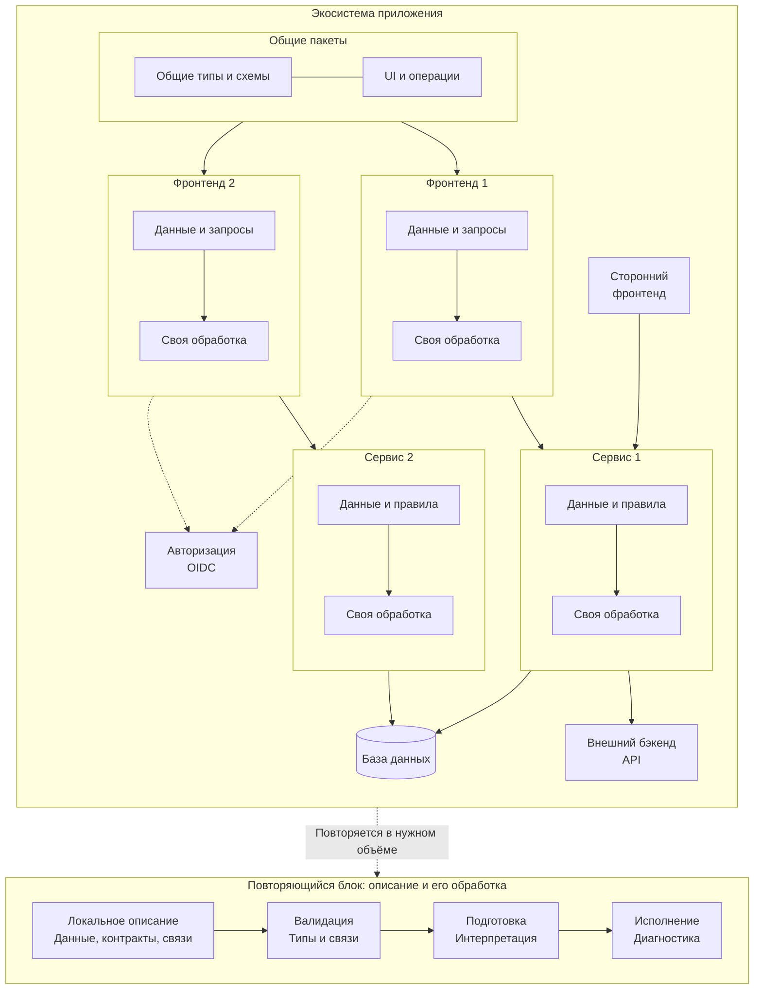
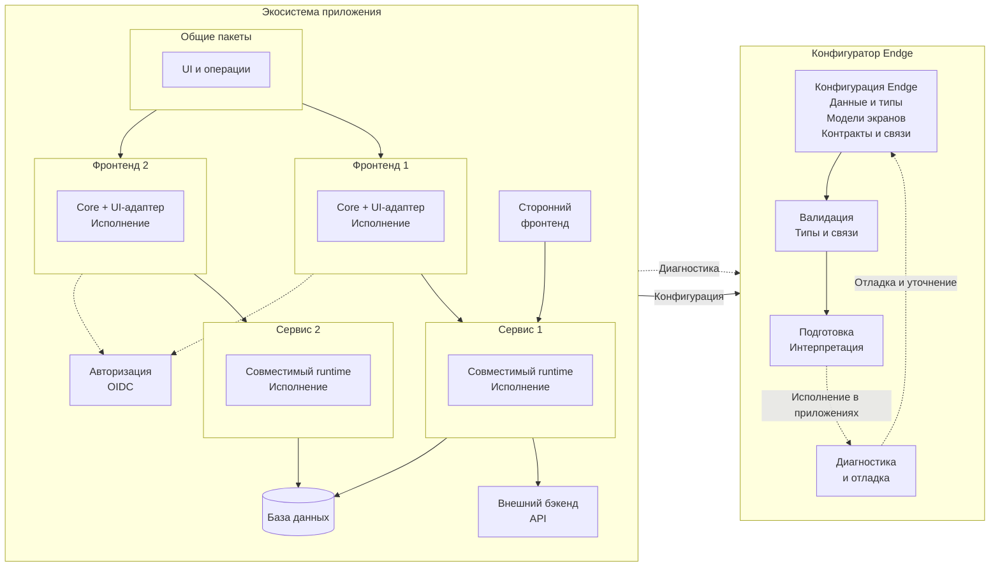

# Что такое Endge

<figure class="endge-author-quote">
  <blockquote>
    Endge — это расширяемая среда разработки конфигураций приложений. Она позволяет описывать структуру и поведение системы в единой модели, собирать прикладные сценарии из переиспользуемых возможностей и использовать это описание в разных технологических окружениях через совместимые runtime-модули и адаптеры.
  </blockquote>
</figure>

<figure class="endge-author-quote">
  <blockquote>
    Конфигуратор Endge предоставляет единое рабочее пространство для разработки, настройки и диагностики конфигураций. Разработчики подключают программные реализации, а участники команды работают с общей моделью через инструменты, соответствующие их задачам и полномочиям.
  </blockquote>
</figure>

Например, приложение для работы с заявками включает фильтры, запросы к сервисам, таблицы и действия над выбранной записью. Endge позволяет описать состав такого экрана и взаимодействие его частей. Программные реализации предоставляют компоненты и операции, а конфигурации определяют, как использовать их в конкретном сценарии.

## Когда общее устройство системы распределено между реализациями

Большая система может состоять из нескольких фронтендов, бэкендов и сервисов в разных репозиториях. У них есть связанные описания данных, операции и правила взаимодействия. Каждая команда воплощает свою часть в выбранной технологии.

По мере роста системы одни и те же решения приходится описывать и поддерживать в нескольких местах. Изменение структуры заявки может затронуть контракт сервиса, форму ввода, таблицу и преобразование данных. Разработчикам нужно найти зависимые части, согласовать изменения и проверить, что они понимают данные одинаково.

Общие библиотеки, схемы и генерация помогают сократить повторение. Но остаётся прикладная сборка: какие данные запросить, как передать параметры, где хранить результат, что показать пользователю и когда выполнить действие. При появлении похожего экрана или нового приложения эти связи часто приходится описывать заново.

Endge делает поддерживаемые описания и связи самостоятельной конфигурационной моделью. Её можно проверять, переиспользовать и развивать вместе с программными реализациями.

## Когда приложениям нужны разные варианты поведения

Ещё одна потребность возникает, когда приложения одной экосистемы должны гибко настраиваться. Для разных заказчиков, подразделений или окружений могут отличаться источники данных, параметры, состав экранов и доступные операции.

Команде становится нужна общая среда управления этими различиями. В обычном проекте для этого можно разработать собственный портал, затем добавить редакторы, проверку связей, версии, предварительный просмотр и диагностику. Поддержка такой среды становится отдельной задачей.

Endge предоставляет расширяемую основу для этой работы. Общие элементы описываются конфигурациями, а варианты задаются в пределах поддерживаемых контрактов. Конфигуратор объединяет работу с ними в одном пространстве. Подробности — на странице [«Единая среда работы»](/getting-started/shared-workspace).

## От распределённых описаний к общей модели

У разных частей приложения есть связанные описания: структура данных, ограничения, контракты операций, настройки и связи. Одни и те же типы и контракты могут участвовать в серверных проверках, запросах и интерфейсах разных приложений. Вместе с описаниями повторяется и работа по их обработке: проверка, подготовка, выполнение и диагностика.

На двух схемах показана одна экосистема: два фронтенда, два микросервиса, общие пакеты, авторизация, внешние интеграции и база данных. Приложения сохраняют собственные задачи и прикладные реализации. Меняется организация поддерживаемых описаний и механизмов работы с ними.

### До Endge: описания и обработка распределены

**Жёлтые блоки — связанные описания, синие — их обработка.** Общие пакеты уже сокращают дублирование, но часть определений и связей остаётся в приложениях. Команда согласует их изменения и реализует необходимые проверки, преобразования и диагностику.

Под экосистемой раскрыт повторяющийся блок. Каждое приложение использует нужные ему этапы: проверяет структуру и контракты, подготавливает данные или интерпретирует описание, выполняет операции и собирает сведения об ошибках. Это обобщённый пайплайн: обычному приложению не обязательно иметь отдельный интерпретатор или реализовывать все этапы.

### С Endge: общая модель и стандартные механизмы

Поддерживаемые определения и связи описываются в конфигураторе как **общая модель приложения**. На схеме эти описания собраны в одном жёлтом блоке **«Конфигурация Endge»** справа от экосистемы. Внутри приложений остаются движки исполнения. Стрелка к конфигурации означает использование общего описания, пунктир — обратную связь для диагностики. Приложения подключают совместимые движки, а пакеты предоставляют реализации и поддерживаемые контракты.

Общий блок Endge объединяет конфигурацию и инструменты работы с ней: валидацию структуры и типов, проверку ссылок и связей, подготовку и интерпретацию. Подготовленную модель исполняют runtime приложений; сведения о состоянии и ошибках поступают в диагностику при её подключении. Обратная связь помогает уточнять модель, проверять сценарии и отлаживать поддерживаемый сеанс runtime.

**Конфигуратор объединяет разработку модели и инструменты наблюдения; runtime исполняется внутри приложений.** На фронтенде это Endge Core вместе с UI-адаптером. Серверная ветка требует библиотеки или runtime для соответствующих контрактов; удалённые диагностика и управление доступны при наличии совместимого подключения. Пайплайн не обозначает центральный сервер, через который проходят рабочие запросы.

В общую модель переходят описания данных и сценариев. Рабочие данные остаются в своих хранилищах, а уникальные алгоритмы — в прикладном коде. Авторизация и сторонние системы выделены нейтральным цветом: команда описывает контракты и настройки интеграции с ними, сохраняя границы внешних реализаций.

### Как из модели получается интерфейс

Например, конфигурация экрана задаёт компоненты, источники данных и связи. Endge Core проверяет описание и исполняет подготовленный сценарий, а UI-адаптер отображает результат с помощью подключённых компонентов. Команда может собирать новые экраны и их варианты из уже реализованных возможностей.

Такой путь является **исполнением конфигурации**: исходный код отдельного фронтенда для каждого экрана генерировать не требуется. Генерация исходного кода или целого сервиса — отдельный возможный способ использования модели, для которого нужен специализированный генератор и поддерживаемый целевой контракт. Автоматическая генерация произвольных микросервисов не входит в описанный механизм Core.

Размещение приложений, серверных сервисов и баз данных показано отдельно в [архитектуре экосистемы](/getting-started/architecture).

## Configuration-first: сначала описываем систему

В подходе **configuration-first** конфигурация становится полноценным описанием структуры и поддерживаемого поведения приложения. Она задаёт используемые возможности, их параметры, связи и условия выполнения. У этого описания есть собственный исходный текст, проверка и путь исполнения.

Разработчик реализует необходимые возможности и предоставляет их через определённые контракты. Затем команда собирает из них прикладные сценарии. Ядро Endge проверяет и компилирует конфигурации, а runtime исполняет подготовленную программу с подключёнными реализациями.

Конфигурация описывает сценарий, а реализации предоставляют средства его выполнения. Новый сценарий может использовать уже подключённые возможности. Если требуется новая операция, компонент или интеграция, разработчик добавляет соответствующую реализацию.

## Пример: несколько приложений для работы с заявками

Предположим, компания развивает рабочее место оператора и кабинет руководителя. Оба приложения используют заявки, но показывают их по-разному. Оператору нужны фильтры и действия над отдельной заявкой, руководителю — сводное представление.

Команда выделяет общие описания данных и доступных операций. Для каждого приложения она собирает собственный сценарий из запросов, преобразований, состояния и компонентов.

| Что нужно сделать | Как распределяется работа |
| --- | --- |
| Подключить сервис заявок | Разработчик предоставляет совместимый транспорт и необходимые операции |
| Собрать список заявок | Конфигурация связывает фильтр, запрос, состояние и таблицу |
| Создать другое представление | Команда переиспользует подходящие документы и задаёт другую композицию |
| Изменить адрес сервиса для окружения | Значение задаётся через поддерживаемую конфигурацию окружения |
| Добавить уникальный алгоритм обработки | Разработчик реализует алгоритм и подключает его через публичный контракт |

Переиспользование определяется смыслом и совместимостью. Если двум сервисам действительно нужны разные модели заявки, их различия сохраняются явно. Единая модель не требует объединять все сущности системы в одну универсальную схему.

## Единая модель и разные технологические окружения

Конфигурации описывают систему через понятия Endge и контракты подключённых возможностей. Приложение использует нужную ему часть этого описания через совместимую библиотеку, runtime или адаптер.

Например, одно описание данных может использоваться для проверки входных значений и построения формы, если оба потребителя поддерживают соответствующий контракт. Замена UI-адаптера может сохранить конфигурацию интерфейса, если новая реализация поддерживает используемые свойства, события и поведение.

Поддержка другого языка, хранилища или среды требует конкретной совместимой реализации. Специфические возможности окружения оформляются явно: адаптер не должен незаметно менять смысл конфигурации.

Приложения могут получать разные наборы документов и использовать независимые данные. Общая среда разработки конфигураций не объединяет их живое состояние и не требует единого процесса исполнения.

## Для кого предназначен Endge

Endge ориентирован на разработчиков, интеграторов и платформенные команды, которые создают семейства приложений, повторяющиеся экраны и сценарии, настраиваемые продукты или общую среду управления конфигурациями.

Его можно внедрять постепенно: начать с одного экрана, подключить необходимые реализации и оценить пользу переиспользования. Оболочка приложения, существующие сервисы и уникальные алгоритмы могут оставаться обычным прикладным кодом.

Совместная работа разработчиков, аналитиков и администраторов строится вокруг общей модели. Конкретные действия каждого участника зависят от доступных редакторов, подключённых расширений и прав — этот подход подробнее описан на [следующей странице](/getting-started/shared-workspace).

## Когда Endge не нужен

Конфигурационная модель полезна, когда команда действительно переиспользует её или меняет независимо от прикладного кода. Для небольшого приложения с несколькими фиксированными экранами прямое программирование может оказаться проще.

Если общие библиотеки уже решают задачу, а почти каждый новый сценарий требует уникального алгоритма, дополнительная модель может увеличить стоимость разработки. Endge также требует участия разработчиков: программные реализации и поддержку целевых окружений нужно создавать и сопровождать.

Перед внедрением стоит выбрать конкретный сценарий и ответить: **что команда сможет переиспользовать или настраивать через конфигурации проще, чем сейчас?**

## Продолжить знакомство

1. [Единая среда работы](/getting-started/shared-workspace) — роли команды, настройка, диагностика и проверка сценариев.
2. [Архитектура экосистемы](/getting-started/architecture) — общая схема приложений, сервисов, авторизации и баз данных.
3. [Как работает Endge](/getting-started/how-endge-works) — документы, компиляция, исполнение и расширения.
4. [Начало работы](/configurator/getting-started) — переход к работе в конфигураторе.
