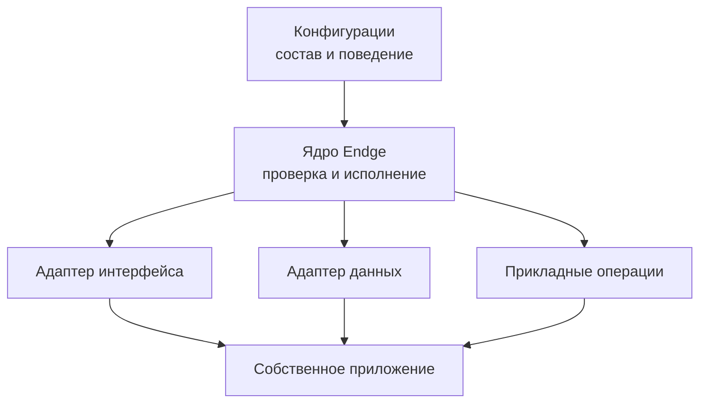
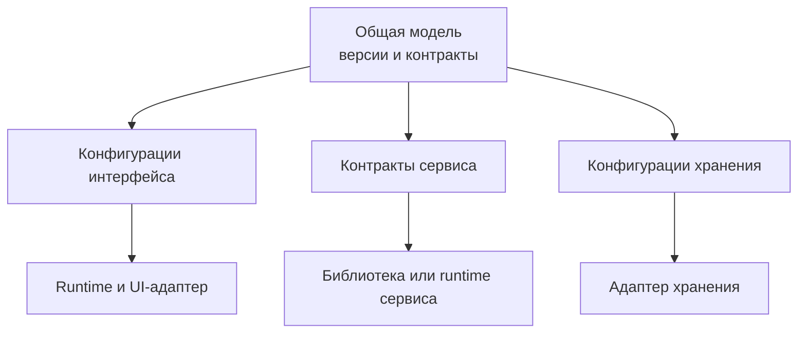

# Что такое Endge

<figure class="endge-author-quote">
  <blockquote>
    Endge — это расширяемая среда разработки конфигураций приложений. Она позволяет описывать структуру и поведение системы в единой модели, а использовать это описание в разных технологических окружениях через совместимые runtime-модули и адаптеры.
  </blockquote>
</figure>

Разработчик формирует конфигурационные документы: запросы, компоненты, действия, хранилища данных, композиции и другие элементы приложения. Ядро Endge проверяет и связывает эти документы, компилирует их и управляет исполнением подготовленной программы.

Конкретные реализации подключаются со стороны приложения. Команда использует собственные компоненты, сервисы и прикладной код, а конфигурации определяют, как эти возможности объединяются в работающую систему.

## Основная идея

При разработке приложения регулярно приходится связывать запросы к данным, состояние, элементы интерфейса и обработчики действий. Endge позволяет описывать эти связи явно и собирать повторно используемые части приложения из конфигурационных документов.

Например, рабочий экран может включать запрос, фильтр, хранилище и таблицу. Композиция связывает их: передаёт параметры фильтра в запрос, публикует результат в хранилище и предоставляет данные таблице. Условия запуска также задаются в конфигурации.

Схема показывает разделение ответственности. Конфигурации задают описываемое поведение, ядро обеспечивает общие правила исполнения, а адаптеры и прикладные реализации предоставляют возможности выбранного окружения.

## Конфигурации как строительные блоки

Конфигурация — это документ с определённым назначением и контрактом. Он описывает отдельную часть приложения и может ссылаться на другие документы.

| Документ | Назначение |
| --- | --- |
| **Type** | Описывает структуру и типы данных |
| **Query** | Описывает запрос, его параметры и выходные данные |
| **Component SFC** | Описывает структуру компонента, свойства и взаимодействия |
| **Store** | Описывает организацию состояния |
| **DataView** | Описывает преобразование и представление данных |
| **Action** | Описывает выполняемые операции |
| **Composition** | Связывает элементы в runtime-граф и управляет их запуском |

Документы можно переиспользовать в разных композициях. Их исходное описание — **Source** — сохраняется в специализированном языке Endge. Знакомые конструкции языка помогают выражать модель, но допустимые операции и их смысл определяются контрактами платформы.

Source проходит проверку и компиляцию. Runtime исполняет подготовленную программу; конфигурация не даёт произвольному коду доступ к окружению приложения.

## Собственное приложение и собственные реализации

Endge встраивается в приложение разработчика. Команда выбирает, какую часть системы описывать конфигурациями и какие возможности подключить через адаптеры и расширения.

Можно начать с отдельного экрана или повторяющегося сценария, а затем расширять использование Endge. Оболочка приложения, существующие сервисы и уникальные алгоритмы могут оставаться обычным прикладным кодом.

Разработчик один раз реализует нужные возможности и предоставляет их через согласованные контракты. Затем конфигурации используют эти реализации в разных сочетаниях.

Общая семантика принадлежит ядру и соответствующим runtime-модулям. Например, UI-адаптер отображает состояние и передаёт события, но не определяет заново порядок запуска запросов или правила обновления зависимостей.

## Единая модель для разных частей системы

Большой проект может включать несколько приложений, сервисов и хранилищ с разными технологическими реализациями. При этом им нужны согласованные описания данных, операций и взаимодействий.

Endge объединяет разработку, проверку и управление версиями таких конфигураций. Каждая часть системы использует нужное ей описание через совместимую библиотеку, runtime или адаптер своего окружения.

Это схема расширения платформы: поддержка каждого вида конфигурации и целевого окружения требует конкретной реализации. Например, одно описание структуры данных может использоваться при проверке входных данных и построении формы, если оба потребителя поддерживают его контракт.

Единая модель не означает, что все сервисы получают один и тот же полный набор документов или разделяют живое состояние. Каждое приложение использует необходимые ему конфигурации и совместимые версии реализаций. Общая точка управления не требует единого процесса исполнения.

## Расширение через плагины

Плагин объединяет возможности, которые команда подключает к Endge для своего проекта. Это могут быть runtime-модули, адаптеры, компоненты и прикладные операции. В более широкой модели расширения к ним могут добавляться средства редактирования, проверки и подготовки соответствующих конфигураций.

Например, расширение для хранения данных может задавать общий контракт поддерживаемых операций, а разные адаптеры — реализовывать его средствами выбранного хранилища. Собственные расширения позволяют переиспользовать внутренние механизмы команды между проектами.

В текущем Core механизм `EndgePlugin` подключает доверенные packages с Modules и Federations до запуска приложения. Он описан в [разделе расширений Federation](/advanced/federation-extensions). Подключение таких packages и установка пользователем произвольного расширения в работающую IDE — разные механизмы; наличие первого не означает готовность второго.

## Переносимость и границы совместимости

Конфигурации используют понятия Endge и публичные контракты подключённых возможностей. Они могут сохраняться при замене технологической реализации, если новое окружение поддерживает необходимые операции, свойства и события.

Общая часть модели остаётся переносимой. Специфические возможности описываются явно и требуют соответствующего расширения. Например, два адаптера хранения могут поддерживать один набор операций, но различаться по возможностям транзакций или запросов.

Неподдерживаемая возможность должна приводить к понятной диагностике. Адаптер не должен незаметно менять смысл конфигурации ради её исполнения.

Перенос модели в другую среду требует совместимого пути её проверки и использования. Для отображения может быть достаточно нового UI-адаптера; для выполнения поведения в другом языке может понадобиться отдельная библиотека или runtime.

## Роль конфигуратора

Веб-конфигуратор — среда работы с документами Endge: редактирования Source, проверки связей, просмотра диагностики, скомпилированной программы и runtime-состояния. История изменений и выпуск конфигураций помогают управлять их развитием и поставкой.

Для поддерживаемых конструкций доступны визуальные редакторы. Они работают с тем же исходным описанием. Структурные формы, превью и схемы связей могут дополнять текстовый редактор по мере поддержки соответствующих операций.

Программист сохраняет контроль над точным описанием и прикладным кодом. Визуальные представления помогают команде обсуждать и проверять модель без необходимости читать каждую строку Source.

## Для кого предназначен Endge

Endge ориентирован на разработчиков, интеграторов и платформенные команды, которым нужно:

- собирать повторяющиеся части приложений из общих элементов;
- уменьшать объём ручного кода, связывающего данные, состояние и интерфейс;
- использовать собственные компоненты и интеграции;
- поддерживать варианты конфигураций для разных проектов и окружений;
- согласовывать контракты между несколькими потребителями;
- сохранять описанное поведение при изменении технологических реализаций.

Ценность подхода — в повторном использовании реализованных возможностей и в явной, проверяемой модели их взаимодействия.

## Когда Endge не нужен

Endge полезен, когда конфигурационная модель становится самостоятельной ценностью: её переиспользуют, изменяют независимо от прикладного кода и применяют в разных проектах или окружениях. Для некоторых задач такая модель добавит больше работы, чем пользы.

- **Небольшое приложение с фиксированным поведением.** Если несколько экранов проще реализовать напрямую и менять вместе с кодом, отдельный слой конфигураций может оказаться избыточным.
- **Система без существенной потребности в настройке и переиспользовании.** Если общие компоненты и библиотеки уже решают задачу, перенос их взаимодействий в конфигурации не обязательно даст дополнительную пользу.
- **Приложение, в котором преобладают уникальные алгоритмы и нестандартные взаимодействия.** Если почти каждый сценарий требует собственной реализации, поддержка конфигурационных контрактов может усложнить разработку.
- **Задача, для которой достаточно готового продукта.** Когда существующее решение покрывает требования, создание своей конфигурационной среды может быть неоправданным.

Endge также не подходит, если от него ожидают готового приложения без программирования, автоматической поддержки любой технологии или переноса системы между окружениями без подготовки совместимых реализаций. Адаптеры, расширения и прикладной код требуют разработки и сопровождения.

Перед внедрением стоит ответить на вопрос: **что именно команда сможет переиспользовать или менять через конфигурации проще, чем через обычный код?** Если убедительного ответа пока нет, внедрение Endge стоит отложить.

## С чего начать

Выберите небольшой сценарий своего приложения: например, таблицу с запросом и фильтрами. Определите необходимые документы и возможности окружения, соберите композицию и проверьте её выполнение.

1. Прочитайте, [как работает Endge](/getting-started/how-endge-works).
2. Познакомьтесь с [модулями конфигуратора](/configurator/modules).
3. Изучите [сущности Endge](/domain/entities).
4. Для конкретного синтаксиса используйте раздел [«Синтаксис и контракты»](/reference/query).
