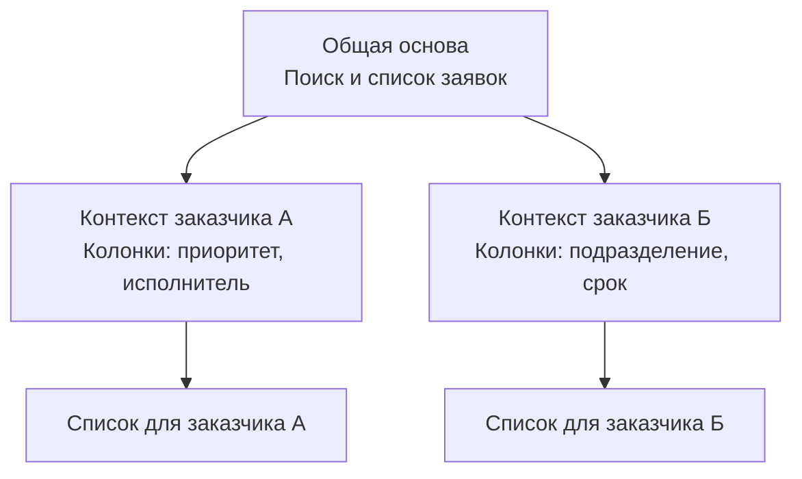
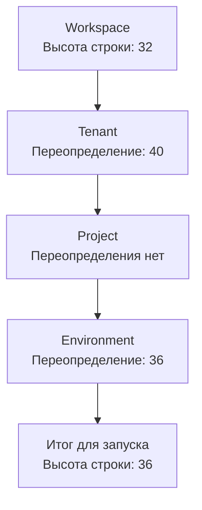

# Контекст и варианты приложений

Одна общая основа может использоваться у разных заказчиков, в нескольких проектах и окружениях. **Контекст определяет условия, для которых подготавливается конфигурация.** Предусмотренные настройки позволяют выразить различия, сохраняя общую часть модели.

## Два заказчика — два варианта

В нашем примере оба заказчика используют поиск и список заявок. Для заказчика А важны приоритет и исполнитель, для заказчика Б — подразделение и срок. Разработчик предусмотрел настройку колонок, и каждый вариант использует собственное значение.

Общая композиция должна действительно читать эту настройку и передавать её таблице. Само наличие значения в контексте не меняет поведение компонента автоматически.

## Откуда берутся настройки

Для Configuration в Endge используются уровни Workspace, Tenant, Project и Environment. Workspace задаёт общую основу, последующие уровни уточняют значения согласно правилам разрешения конфигурации.

На схеме показано разрешение одного числового параметра. Правила для вложенных значений, замены и наследования определяются [контрактом Configuration](/reference/configuration). Эти уровни задают порядок применения настроек, а не универсальное дерево владения всеми документами.

Итоговые значения доступны потребителям через конфигурацию контекста. Для подготовки программы важен согласованный контекст: артефакт, собранный с другими значимыми настройками, нельзя считать актуальным без соответствующего обновления.

## Какие различия можно выразить

| Изменение | Что требуется |
| --- | --- |
| Другая высота строки или набор колонок | Предусмотренная настройка и потребитель, который её использует |
| Другой параметр конкретного экземпляра компонента | Поддерживаемый вход компонента и его привязка в композиции |
| Другая реализация отображения | Совместимый адаптер, поддерживающий используемые возможности |
| Новый способ обработки заявки | Программная реализация, контракт и включение в сценарий |

Параметры экземпляра компонента не образуют автоматически новый уровень Configuration. Подключение runtime-модуля тоже имеет собственный жизненный цикл. Общая идея точек расширения объединяет эти способы на уровне проектирования, сохраняя различия их механизмов.

## Общая основа имеет версии

Изменения общей модели могут затрагивать несколько потребителей. Один клиент уже поддерживает новую операцию, другой ещё использует прежний контракт. Поэтому выпуск конфигураций и обновление программных реализаций согласуются явно.

Настройка контекста определяет вариант внутри поддерживаемых возможностей. Версия определяет, с каким выпуском описаний и контрактов работает потребитель. Эти две задачи нужно учитывать отдельно.

Для изменения списка заявок команда выбирает версию общей основы, проверяет нужные контексты и готовит совместимую поставку. Общая точка разработки облегчает эту работу, но не устраняет необходимость миграций и проверки совместимости.

## Понимать действующий вариант

При разборе поведения полезно установить выбранный контекст, версию описаний, действующие значения и место их применения. Например, выяснить, почему строка имеет высоту 36: значение задано окружением и прочитано компонентом таблицы.

Такой способ анализа помогает отличить ошибку настройки от ошибки общей модели или реализации. Он также задаёт ориентир для инструментов конфигуратора: делать происхождение и влияние различий понятными участникам команды.

Далее: [как конфигурация становится работающим сценарием](/product-v2/how-it-works).
