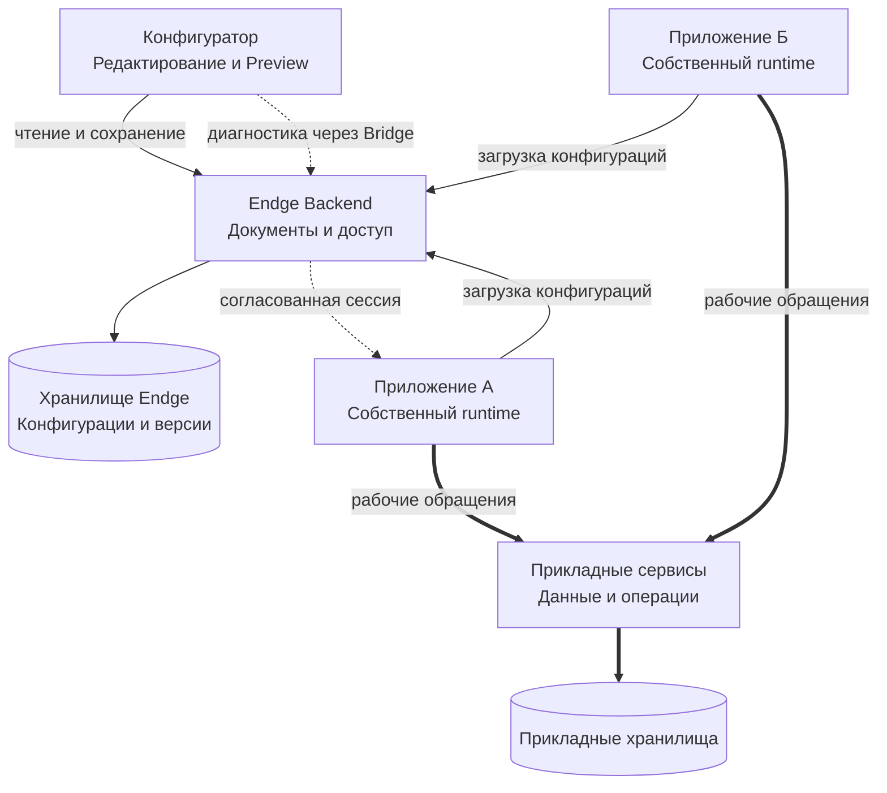

# Архитектура экосистемы

Конфигуратор служит рабочим пространством разработки метамодели. Backend хранит её документы и проверяет доступ, а приложения используют необходимые конфигурации через совместимые runtime и реализации.

**Разработка, хранение описаний и исполнение имеют разных владельцев.** Это позволяет нескольким приложениям использовать общую основу и сохранять собственные задачи, данные и жизненные циклы.

## Основные участники

Обычные стрелки показывают работу с конфигурациями, толстые — прикладные обращения, пунктир — отдельный диагностический путь. Стрелки направлены от инициатора к получателю; ответы не показаны. Для простоты диагностика нарисована только для приложения А.

Вместо загрузки документов с Backend приложение может использовать подготовленный bundle, если этот путь поддерживается его интеграцией. Прикладные данные передаются через реализации запросов и операций; схема не требует проводить их через конфигуратор.

## Конфигуратор и Backend

Конфигуратор — браузерное приложение для работы с документами, настройками и диагностикой. Его Runtime Preview создаёт собственные экземпляры исполнения для поддерживаемых сценариев.

Endge Backend отвечает за хранение документов, API и серверную проверку доступа. Несколько участников могут работать с одним сервером в пределах доступных им рабочих пространств. Конфигурации и их версии хранятся в базе Endge.

Для пользовательского входа подключается поддерживаемая аутентификация, например OIDC-провайдер. Детали настройки относятся к [разделу установки](/configurator/installation).

## Приложения и рабочие данные

Клиентское приложение включает свою оболочку, Endge Core и совместимые реализации. Core работает внутри приложения; runtime исполняет подготовленный сценарий, а UI-адаптер связывает его с отображением.

В приложении заказчика А список заявок получает данные из прикладного API и использует настройки своего контекста. Приложение заказчика Б может использовать ту же основу с другими настройками и независимым состоянием.

Бизнес-операции и рабочие данные остаются у соответствующих сервисов и хранилищ. Для использования конфигураций в серверном процессе нужен потребитель или runtime, который поддерживает необходимые контракты. Произвольный сервис не становится исполнителем модели только благодаря присутствию на общей схеме.

## Поставка конфигураций

Release конфигураций фиксирует переносимое описание для поставки. Program содержит результат подготовки для конкретного compiler path. Эти результаты имеют разные назначения и не считаются взаимозаменяемыми форматами.

Каждое приложение получает нужные документы через свой поддерживаемый источник и подготавливает их к исполнению. Версии конфигураций, runtime и программных реализаций должны быть совместимы. Разным потребителям могут требоваться разные наборы документов и разные сроки перехода на новый выпуск.

## Дополнительные возможности

Состав установки расширяется по задачам команды. AI Workbench обслуживает поддерживаемые AI-сценарии, Mock Generator создаёт тестовые данные, а Bridge связывает согласованные диагностические сессии. Их наличие не заменяет контракт подключения конкретного сценария.

Телеметрия, внешние справочники и другие интеграции подключаются отдельно. Полный состав компонентов и их технические связи приведены в [подробной архитектуре](/getting-started/architecture).

## С чего начать

Для первого знакомства выберите один сценарий и необходимые реализации. Опишите общую основу, предусмотрите одно реальное различие между двумя вариантами и проверьте оба контекста в поддерживаемом окружении.

Так команда оценит, что становится проще переиспользовать и настраивать, прежде чем распространять подход на другие приложения.

Перейти к [началу работы](/configurator/getting-started) или вернуться к [обзору Endge](/product-v2/).
