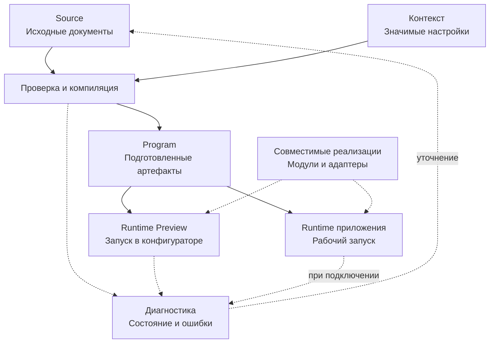

# Как работает Endge

Метамодель хранится в виде связанных конфигурационных документов. Чтобы получить работающий сценарий, Endge учитывает контекст, проверяет исходное описание, подготавливает программу и создаёт её экземпляры исполнения.

## От описания к исполнению

Схема показывает общий путь подготовки и исполнения. Каждый потребитель использует свой поддерживаемый способ загрузки и компиляции. Она не означает, что один артефакт Program можно передать любому приложению или что рабочий runtime зависит от открытого конфигуратора.

## Source: то, что редактирует команда

Исходные документы описывают типы, запросы, компоненты, композиции и другие поддерживаемые возможности. Для source-first документов исходный текст остаётся источником истины. Визуальный редактор изменяет то же описание через свой поддерживаемый путь редактирования.

В списке заявок команда задаёт запрос, связи фильтра и таблицы, а также использование настроек контекста. Сохранение этих документов фиксирует описание. Получение заявок происходит при выполнении соответствующего сценария.

DSL Endge позволяет выразить поддерживаемые конструкции. Произвольные алгоритмы подключаются через программные реализации и разрешённые точки расширения.

## Program: проверенное и подготовленное описание

Компилятор разбирает Source и создаёт артефакты для поддерживаемых типов документов. На этом этапе он проверяет синтаксис и предусмотренные контрактами типы, ссылки и зависимости.

В Program находятся подготовленное представление и диагностика. Для обычного запуска сохранённого source-first документа требуется актуальный валидный артефакт. Если описание изменилось, прежний результат подготовки может стать устаревшим.

Черновик можно проверять в отдельном preview-контексте. Такой запуск позволяет исследовать изменение до его включения в рабочую поставку.

## Runtime: данные и ресурсы конкретного запуска

Runtime создаёт экземпляры подготовленного сценария и управляет их состоянием и ресурсами. В нашем примере изменение фильтра передаёт параметры и запускает запрос; полученные заявки попадают в состояние списка и отображаются таблицей.

Два приложения могут использовать одну основу и иметь независимые запросы, выбранные строки и подписки. Завершение runtime-scope освобождает принадлежащие ему ресурсы.

## Реализации и адаптеры

Core предоставляет механизмы работы с конфигурациями, а подключённые runtime-модули обеспечивают поддерживаемые операции. Адаптер связывает определённый контракт со средствами окружения: например, отображает компонент или обращается к внешнему сервису.

Замена UI-адаптера сохраняет конфигурацию только тогда, когда новая реализация поддерживает используемые свойства, события и поведение. Для другого языка или среды нужен совместимый потребитель либо runtime. Переносимое описание само по себе не создаёт такую реализацию.

## Что можно проверить до запуска

| Вид проверки | Что она позволяет установить |
| --- | --- |
| Разбор и компиляция | Соответствует ли описание поддерживаемому синтаксису и контрактам |
| Запуск с подготовленными данными | Как конкретный сценарий обрабатывает выбранные входные условия |
| Запуск с реальными интеграциями | Как сценарий работает с фактическими сервисами и доступами |
| Измерение под нагрузкой | Как выбранная реализация ведёт себя при заданной нагрузке |

Успешная компиляция не доказывает правильность бизнес-результата или производительность таблицы. Для этого требуется исполнение и критерий, с которым команда сравнивает наблюдаемый результат.

Далее: [как команда работает с моделью в конфигураторе](/product-v2/workspace). Подробности — в [жизненном цикле документов](/domain/lifecycle).
