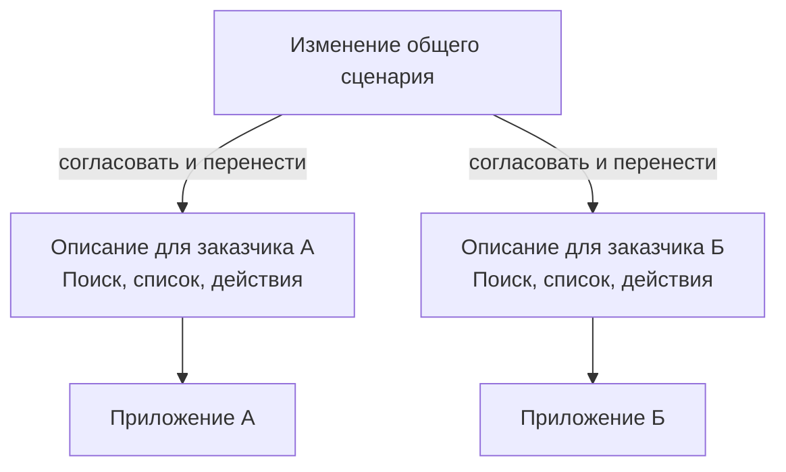
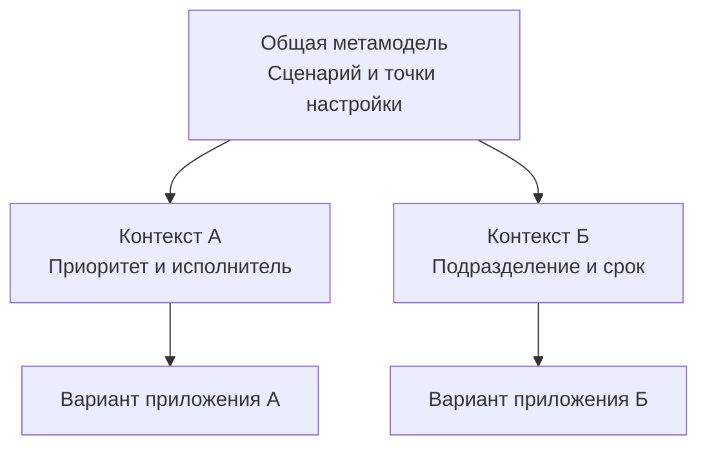

# Что такое Endge

**Endge — расширяемая среда разработки конфигурационных метамоделей приложений.** Метамодель описывает общую структуру и поддерживаемое поведение семейства приложений, а также допустимые способы их настройки и расширения. Конфигуратор объединяет инструменты, с помощью которых команда разрабатывает это описание, проверяет его и настраивает конкретные варианты системы.

Например, два заказчика используют приложение для работы с заявками. Обоим нужны поиск, список заявок и действия над выбранной записью. Но одному важны приоритет и исполнитель, другому — подразделение и срок. Endge позволяет выразить общую основу и предусмотренные различия в конфигурациях, которые используют подключённые программные возможности.

## Знакомая система, растущая стоимость изменений

Современное приложение может включать несколько интерфейсов, серверных сервисов и хранилищ. У этих частей есть связанные описания: какие данные существуют, какие операции доступны и как участники обмениваются результатами. Разработчики воплощают свою часть устройства системы средствами выбранных технологий.

Пока требования стабильны, поддерживать согласованность относительно просто. Затем меняется контракт заявки, появляется новый экран или заказчик просит особый вариант процесса. Команде приходится находить зависимые части, согласовывать изменения и проверять их совместимость. Потребители обновляются в разное время, а похожие решения постепенно расходятся.

Общие библиотеки и схемы помогают переиспользовать код и контракты. Прикладные связи и различия между вариантами тоже требуют явного описания: какой запрос выполнить, какие параметры передать, что показать и какое действие запустить.

## Общая основа и управляемые различия

Рассмотрим два способа поддерживать список заявок. В первом случае команда развивает два отдельных описания похожего сценария. Исправление общей части нужно перенести в каждое из них.

Во втором случае общая часть описана один раз. Метамодель предусматривает настройку колонок и фильтров, а каждый заказчик задаёт нужные значения. Команда проверяет изменение общей основы в используемых контекстах.

Схемы показывают организацию описаний. Конкретные приложения сохраняют собственные данные и исполнение. Общая основа может иметь несколько версий, а переход потребителей между ними требует согласования.

## Что делает команда в Endge

Разработчик создаёт необходимые операции, компоненты и интеграции, предоставляет их контракты и определяет допустимые способы настройки. В конфигураторе команда связывает эти возможности в прикладные сценарии, проверяет описание и исследует поддерживаемое исполнение.

При новом требовании сначала выясняют, можно ли выразить его через существующую точку настройки. Если можно, меняют конфигурацию нужного контекста. Если необходима новая возможность, разработчик добавляет её реализацию и расширяет модель. Качество метамодели зависит от того, насколько осмысленно проведена эта граница.

Приложение использует подготовленный сценарий через совместимый runtime и адаптеры. Это позволяет отделить развитие конфигураций от части технических деталей, сохраняя явные требования к реализациям.

## Где подход приносит пользу

Endge полезен командам, которые развивают семейства приложений, повторяющиеся экраны и сценарии или продукты с различиями для заказчиков. Основной результат — возможность переиспользовать общее описание, явно задавать варианты и обсуждать их в одном рабочем пространстве.

Для небольшого приложения с фиксированным поведением прямое программирование может быть проще. Если почти каждое изменение требует уникального алгоритма, стоимость дополнительной модели нужно сопоставить с пользой её переиспользования.

Начать можно с одного сценария: например, описать список заявок и два варианта колонок. Это позволит оценить удобство разработки и настройки до расширения подхода на другие части системы.

Далее: [из чего состоит метамодель приложения](/product-v2/metamodel).
