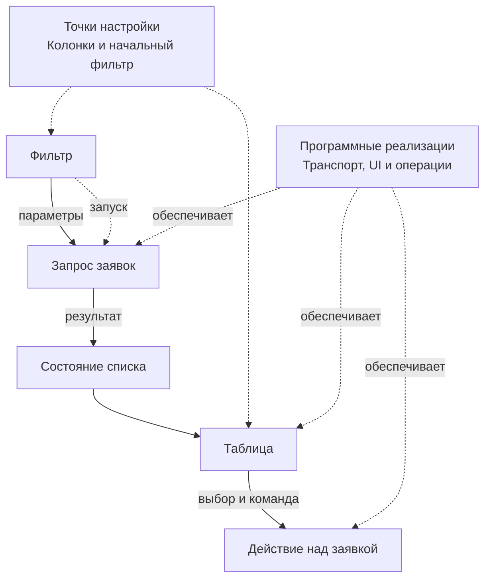

# Метамодель приложения

**Метамодель Endge описывает общую структуру, поддерживаемое поведение и допустимые различия между вариантами приложений.** Она помогает команде проектировать общую основу и заранее определять места, в которых конкретный сценарий можно настроить или расширить.

В этом разделе «метамодель» — продуктовое название связанного конфигурационного описания и предусмотренных им способов построения вариантов. Она выражается через существующие документы и контракты Endge. Это понятие не обозначает отдельный тип сохраняемого документа.

## Три уровня описания

| Понятие | На какой вопрос отвечает | Пример |
| --- | --- | --- |
| Метамодель | Что общего у приложений и какие различия допустимы? | Список заявок с настраиваемыми колонками и фильтрами |
| Конфигурация в контексте | Какой вариант нужен в конкретных условиях? | Для заказчика А показывать приоритет и исполнителя |
| Runtime | Что происходит в текущем запуске? | Загружены 20 заявок, пользователь выбрал одну строку |

Конкретные заявки и выбранная строка относятся к состоянию исполнения. Их описание, способы получения и связи интерфейса принадлежат конфигурационной модели.

## Из чего состоит общая основа

В метамодели связаны описания данных, контракты операций, компоненты и сценарии их взаимодействия. Например, тип заявки определяет структуру записи, запрос — способ получения списка через подключённый транспорт, а композиция — передачу параметров и результата между участниками.

Сценарий списка заявок можно представить так:

Сплошные стрелки показывают передачу данных и команд. Пунктиром обозначены условие запуска, настройки и связь с реализациями. Конфигурация определяет сценарий, а реализации предоставляют средства его выполнения.

## Точки настройки и расширения

Разработчик решает, какие различия модель допускает. Например, он может предусмотреть список видимых колонок, начальный фильтр или выбор совместимого компонента. У каждой такой точки есть смысл, допустимые значения и потребитель, который применяет настройку.

В обсуждении архитектуры такие места можно называть **слотами**. Это собирательное обозначение точек настройки и расширения; конкретный механизм определяется контрактом. Параметр компонента, значение Configuration и подключение программной реализации решают разные задачи.

Чем лучше точка настройки соответствует реальному различию между приложениями, тем меньше условностей требуется в общей модели. Возможность произвольно менять любой участок сделала бы поведение труднее предсказывать и проверять.

## Что остаётся в программном коде

Программные реализации обеспечивают компоненты интерфейса, операции, транспорт и уникальные алгоритмы. Метамодель описывает, как использовать поддерживаемые возможности в конкретном сценарии.

Например, требование показывать другую колонку может укладываться в существующую настройку. Новый способ расчёта приоритета может потребовать отдельной операции, её реализации и контракта. После подключения операция становится доступна для использования в конфигурациях.

Описывать всю инфраструктуру компании или объединять разные предметные области в одну универсальную схему не требуется. Каждая часть метамодели должна иметь понятный смысл и реальных потребителей.

## Как оценить качество метамодели

Полезно проверить её на двух конкретных вариантах приложения. Видно ли, какая часть у них общая? Понятно ли, где заданы отличия? Можно ли изменить общую часть и определить, какие сценарии нужно проверить?

Такие вопросы помогают найти границы переиспользования. Иногда правильное решение — две разные композиции из общих элементов. Дополнительная универсальность оправдана, когда она упрощает реальные сценарии.

Далее: [как контекст определяет вариант приложения](/product-v2/context). Точные виды документов описаны в разделе [«Сущности Endge»](/domain/entities).
