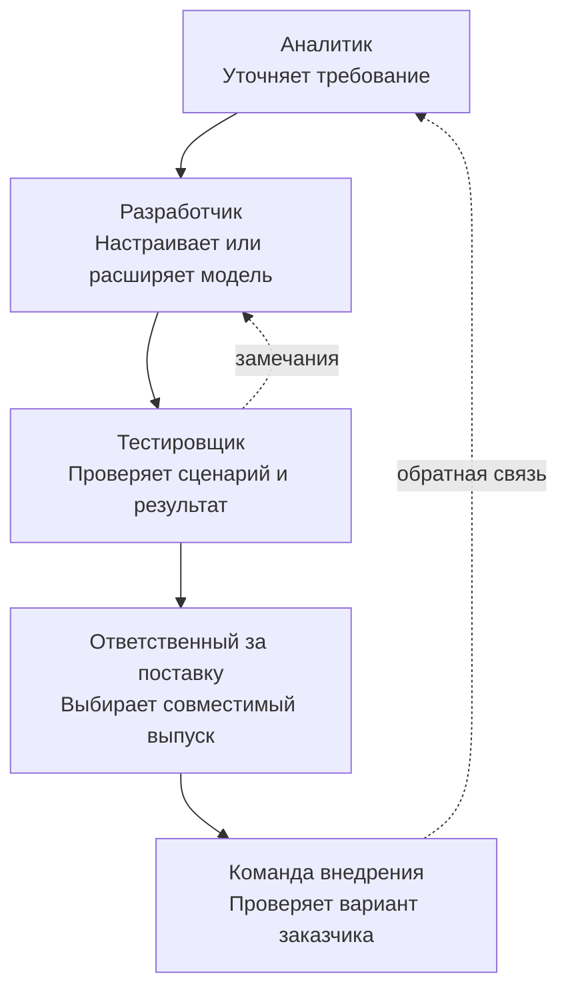

# Единая среда работы

**Конфигуратор Endge объединяет работу с общей метамоделью и её конкретными вариантами.** Участники команды обращаются к связанным документам, настройкам и диагностике через инструменты, соответствующие их задачам и полномочиям.

Общий предмет работы помогает обсуждать изменение на конкретном сценарии: какая возможность нужна, где она описана, как настроена для заказчика и что происходит при запуске.

## От требования до проверенного варианта

Заказчик А просит показывать исполнителя заявки и добавить фильтр по нему. Команда сначала выясняет, предусмотрены ли нужная колонка и параметр фильтра. Если возможность уже есть, достаточно настроить вариант. Если её нет, разработчик расширяет соответствующий контракт и реализацию.

Диаграмма показывает рабочий процесс команды. Доступные действия в самом конфигураторе зависят от редакторов, интеграций и прав. Связь требования с реализацией участники устанавливают при анализе; наличие общей модели само по себе не создаёт автоматическую трассировку всех бизнес-требований.

## Один предмет работы, разные задачи

| Участник | Работа с моделью | Результат |
| --- | --- | --- |
| Разработчик | Создаёт документы, реализации и точки расширения | Поддерживаемый способ выразить сценарий |
| Аналитик | Сопоставляет сценарий с требованиями и уточняет различия | Понятное описание нужного поведения |
| Тестировщик | Подготавливает данные, воспроизводит сценарий и исследует ошибки | Проверенный результат или замечание |
| Ответственный за внедрение | Задаёт доступные настройки выбранного контекста | Конкретный вариант для заказчика |

В конфигураторе можно работать с исходным описанием, использовать доступные визуальные редакторы и исследовать поддерживаемый runtime. При этом добавление новой программной операции остаётся задачей разработки соответствующей реализации.

## Проверка на подготовленных данных

Для списка заявок полезно проверить пустой ответ, несколько типовых записей и большой набор строк. Mock-документы и поддерживаемые mock-настройки Query позволяют подготовить данные, а Runtime Preview — исследовать конкретный запуск.

Команда проверяет, как выглядят колонки, что происходит при фильтрации и какие данные передаются действию. Модель сценария сохраняет свои связи; выбранный mock-путь меняет получение данных в пределах поддерживаемого контракта.

Большой набор строк помогает исследовать нагрузку на интерфейс. Для измерения производительности нужны определённые условия, длительность и показатели. Такой запуск не измеряет пропускную способность реального серверного сервиса.

## Диагностика исполнения

При ошибке полезно пройти от документа к подготовленной программе и затем к состоянию runtime. Например, пустая таблица может быть следствием неверной привязки параметра, пустого ответа сервиса или ошибки отображения.

Для совместимого внешнего приложения при настроенном Bridge и согласованной отладочной сессии доступен путь получения диагностики. Набор удалённых действий определяется контрактом подключения. Локальный Preview и диагностика рабочего приложения относятся к разным экземплярам исполнения.

## Развитие автоматизированной проверки

Естественное развитие среды — воспроизводимые тест-кейсы рядом с моделью: входные условия, подмены данных, действия и ожидаемый результат. Это позволит проверять варианты по одинаковым критериям и сравнивать результаты при изменении общей основы.

Сейчас доступны создание и проверка описаний Simulation, mock-данные и поддерживаемые сценарии Runtime Preview. Исполнение сохранённых Simulation, автоматическое сравнение с ожидаемым результатом и запуск нагрузочных тест-кейсов из общей панели пока не подключены. Эти возможности относятся к направлению развития среды.

## Совместная работа и версии

Общее рабочее пространство даёт участникам доступ к связанным документам. Сохранение использует revisions и обработку конфликтов; оно не означает одновременное редактирование одного текста в реальном времени.

Перед поставкой команда согласует версии описаний и реализаций, проверяет необходимые контексты и выбирает способ доставки конфигураций. Проверка одного preview-сценария подтверждает его наблюдаемое поведение в выбранных условиях.

Далее: [как конфигуратор связан с приложениями и сервисами](/product-v2/ecosystem).
