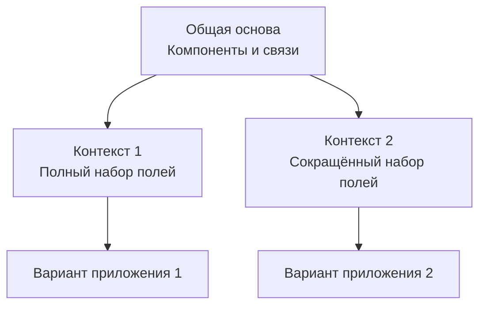
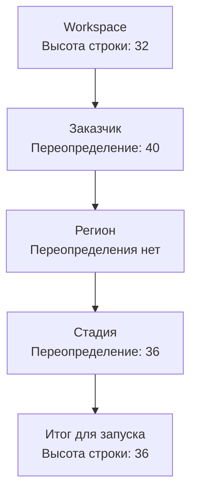

# Контекст и варианты приложений

Одна общая основа может использоваться у разных заказчиков, продуктов, регионов и стадий поставки. **Контекст определяет условия, для которых подготавливается конфигурация.** Workspace задаёт нужные фасеты, а их выбранные документы выражают различия, сохраняя общую часть модели.

## Два контекста — два варианта

Предположим, компонент 1 передаёт параметры запросу, а компонент 2 отображает результат. Этот сценарий используется в двух контекстах. Разработчик предусмотрел настройку компонента 2: в контексте 1 он показывает полный набор полей, в контексте 2 — сокращённый.

Общая композиция должна действительно читать эту настройку и передавать её компоненту 2. Само наличие значения в контексте не меняет поведение компонента автоматически.

## Откуда берутся настройки

Workspace задаёт общую основу Configuration. Последующие уровни — это активные
динамические фасеты текущего Domain. Их названия, документы и порядок создаёт
автор модели; Core применяет выбранные документы по сохранённой позиции фасета.

На схеме показано разрешение одного числового параметра. Правила для вложенных значений, замены и наследования определяются [контрактом Configuration](/reference/configuration). Эти уровни задают порядок применения настроек, а не универсальное дерево владения всеми документами.

Итоговые значения доступны потребителям через конфигурацию контекста. Для подготовки программы важен согласованный контекст: артефакт, собранный с другими значимыми настройками, нельзя считать актуальным без соответствующего обновления.

## Какие различия можно выразить

| Изменение | Что требуется |
| --- | --- |
| Другая высота строки или набор колонок | Предусмотренная настройка и потребитель, который её использует |
| Другой параметр конкретного экземпляра компонента | Поддерживаемый вход компонента и его привязка в композиции |
| Другая реализация отображения | Совместимый адаптер, поддерживающий используемые возможности |
| Новый способ обработки данных | Программная реализация, контракт и включение в сценарий |

Параметры экземпляра компонента не образуют автоматически новый уровень Configuration. Подключение runtime-модуля тоже имеет собственный жизненный цикл. Общая идея точек расширения объединяет эти способы на уровне проектирования, сохраняя различия их механизмов.

## Общая основа имеет версии

Изменения общей модели могут затрагивать несколько потребителей. Один клиент уже поддерживает новую операцию, другой ещё использует прежний контракт. Поэтому выпуск конфигураций и обновление программных реализаций согласуются явно.

Настройка контекста определяет вариант внутри поддерживаемых возможностей. Версия определяет, с каким выпуском описаний и контрактов работает потребитель. Эти две задачи нужно учитывать отдельно.

При изменении общего сценария команда выбирает версию основы, проверяет нужные контексты и готовит совместимую поставку. Общая точка разработки облегчает эту работу, но не устраняет необходимость миграций и проверки совместимости.

## Понимать действующий вариант

При разборе поведения полезно установить выбранные документы фасетов, версию
описаний, действующие значения и место их применения. Например, выяснить, почему
строка имеет высоту 36: значение задано документом фасета «Стадия» и прочитано
компонентом таблицы.

Такой способ анализа помогает отличить ошибку настройки от ошибки общей модели или реализации. Он также задаёт ориентир для инструментов конфигуратора: делать происхождение и влияние различий понятными участникам команды.

Далее: [как конфигурация становится работающим сценарием](/product/how-it-works).
