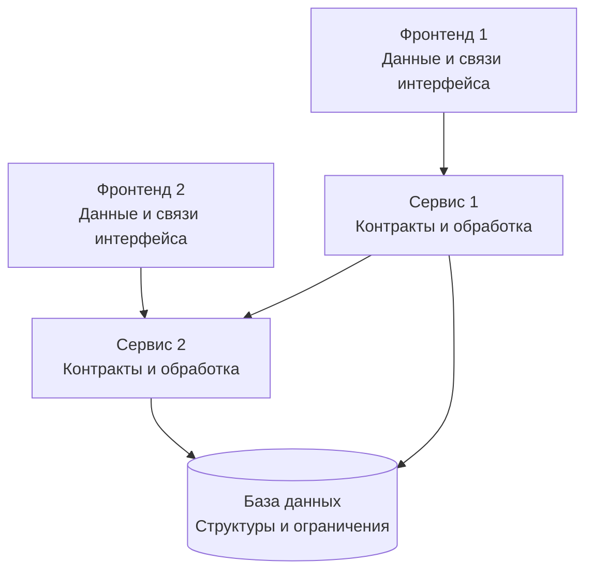
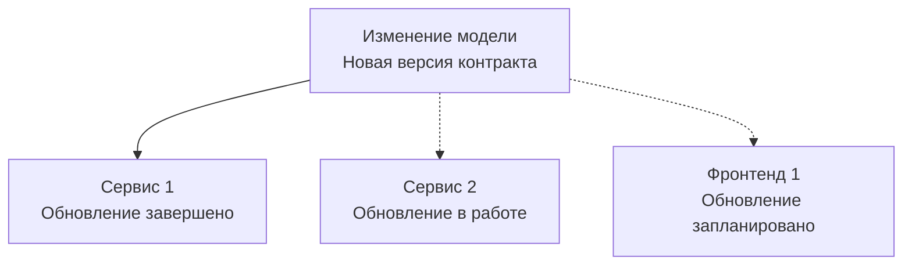
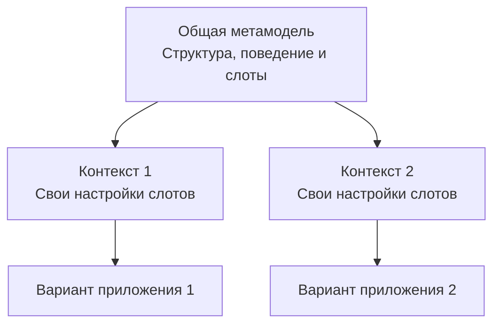
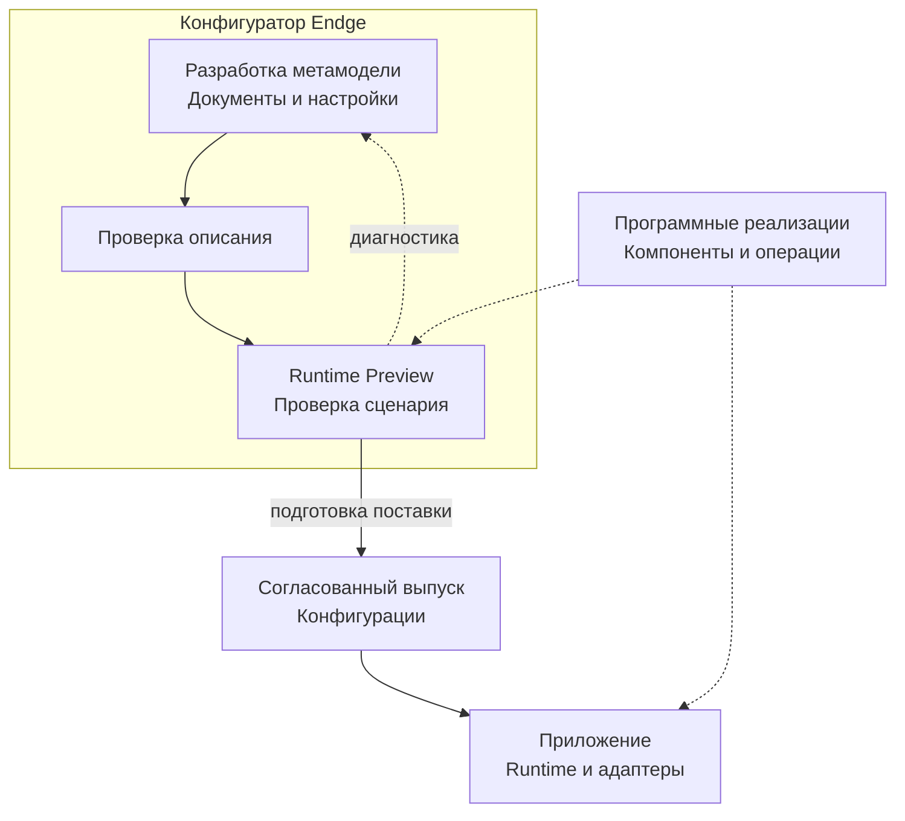

# Что такое Endge

У любого приложения есть своя модель: представление о том, какие данные существуют, какие операции доступны и по каким правилам взаимодействуют части системы. Эта модель определяет устройство приложения и его поведение.

Она не обязательно существует как отдельное описание. Часто модель неявно выражена в программных реализациях: структурах базы данных, контрактах API, логике сервисов, формах и компонентах интерфейса. Чтобы понять устройство системы целиком, приходится собирать это представление из нескольких источников.

В экосистеме из нескольких приложений модель распределяется ещё шире. Фронтенд 1 обращается к сервису 1, тот взаимодействует с сервисом 2. Фронтенд 2 использует часть тех же данных и операций, но организует работу с ними иначе. Каждый участник реализует свою часть системы средствами выбранной технологии.

На схеме стрелки показывают обращения между участниками. Внутри каждого из них реализована часть общей модели. Между этими частями есть договорённости: в каком формате передаются данные, какие операции можно вызывать, какие ограничения необходимо соблюдать. Даже если договорённости не собраны в одном месте, они существуют в коде и определяют, как работает система.

## Когда модель развивается

Пока модель стабильна, её реализации могут оставаться согласованными. Сложности становятся заметнее, когда она начинает развиваться.

Например, меняется структура данных, которыми обмениваются несколько сервисов. Изменение нужно учесть в контрактах, обработке данных и интерфейсах. Но участники обновляются не одновременно: сервис 1 уже поддерживает новую структуру, сервис 2 ещё использует прежнюю, а обновление фронтенда запланировано позже.

Это схема распространения изменения: сплошная стрелка обозначает завершённое обновление, пунктир — предстоящую работу. Команде приходится находить зависимые части, согласовывать переход и поддерживать совместимость версий.

Общие библиотеки, схемы и генерация кода помогают сократить повторение. При этом остаётся задача развития прикладной модели: какие возможности используются в каждом приложении, как они связаны и что необходимо изменить у потребителей.

## Когда нужны разные варианты

Дополнительная сложность возникает, когда одна система используется в разных условиях.

Для одного заказчика нужен определённый набор параметров и операций, для другого — другое поведение в отдельных точках. Один проект использует полный состав интерфейса, другой — только его часть. Даже два экземпляра одного компонента могут работать с общей структурой данных, но отличаться настройками и связями с остальными участниками.

Таким образом, модель развивается сразу в двух направлениях: **меняется со временем и приобретает варианты для разных условий использования.**

Можно поддерживать отдельное описание для каждого варианта. Однако по мере роста их числа общие изменения приходится переносить между копиями и проверять, не разошлись ли они там, где должны оставаться одинаковыми.

Другой подход — выделить общую основу и предусмотреть в ней явные точки настройки и расширения. Тогда различия задаются в определённых местах и по известным правилам.

Например, общая модель описывает взаимодействие компонента 1 с компонентом 2 и получение данных от сервиса 1. В конкретном варианте могут отличаться параметры компонентов или используемая реализация операции — если модель предусматривает такую возможность.

## Точки расширения и контекст

Эти точки можно представить как **слоты**: места, в которых модель допускает настройку, выбор или подключение совместимой реализации. У каждого слота есть назначение и контракт. Разработчик определяет, какие различия нужны приложениям и как выразить их, сохраняя понятное поведение общей основы.

Условия использования образуют **контекст**. Например, заказчик, проект или окружение могут определять, какие настройки должны действовать в конкретном случае. Автор модели выбирает нужные измерения контекста. Общая основа вместе с настройками задаёт вариант приложения для выбранных условий.

В Endge такую общую основу мы называем **метамоделью**. Она описывает структуру и поддерживаемое поведение семейства приложений, а также допустимые способы их настройки и расширения.

Каждый вариант использует общую основу и предусмотренные для него настройки. Команда развивает метамодель и явно поддерживает различия между вариантами. У общей основы остаются версии, а совместимость с потребителями требует согласованного управления.

## Что делает Endge

**Endge предоставляет расширяемую среду разработки такой метамодели.**

В конфигураторе команда описывает данные, операции, компоненты и связи между ними, собирает сценарии и определяет предусмотренные настройки. Программные реализации предоставляют необходимые возможности: отображение интерфейса, взаимодействие с сервисами, обработку данных и выполнение алгоритмов.

Когда появляется новое требование, команда определяет, каким способом его реализовать. Если метамодель уже предусматривает нужную настройку, достаточно изменить конфигурацию соответствующего контекста. Если требуется новая возможность, разработчик добавляет её реализацию и расширяет описание. Endge предоставляет средства для этой работы; качество и удобство точек расширения остаются результатом проектирования.

Конфигурационные документы проходят проверку и подготовку к исполнению. Совместимый runtime выполняет подготовленный сценарий внутри приложения, а адаптеры связывают его с технологиями окружения. Использование общей модели в другой среде требует реализации, которая поддерживает необходимые контракты и сохраняет их смысл.

Схема показывает работу с описанием в конфигураторе и его использование в приложении. Подготовка к исполнению выполняется через поддерживаемый путь каждого потребителя; выпуск конфигураций и запуск приложения согласуются командой.

В самом конфигураторе можно проверить описание и воспроизвести поддерживаемый сценарий в Runtime Preview. Часть ошибок — например, ошибки синтаксиса, типов и ссылок — обнаруживается до запуска. Для проверки поведения используются конкретные входные условия, подготовленные данные и диагностика исполнения.

Вокруг метамодели складывается общее рабочее пространство. Разработчики создают и расширяют возможности, аналитики сопоставляют сценарии с требованиями, тестировщики проверяют поведение, а ответственные за внедрение задают доступные настройки конкретного заказчика или проекта.

Ценность Endge проявляется там, где команда регулярно развивает общую основу и поддерживает несколько её вариантов. Явная метамодель позволяет работать с этими решениями как с самостоятельным предметом разработки: понимать общую структуру, выражать различия и прослеживать путь от конфигурации до исполнения.

Далее: [из чего состоит метамодель приложения](/product/metamodel).
