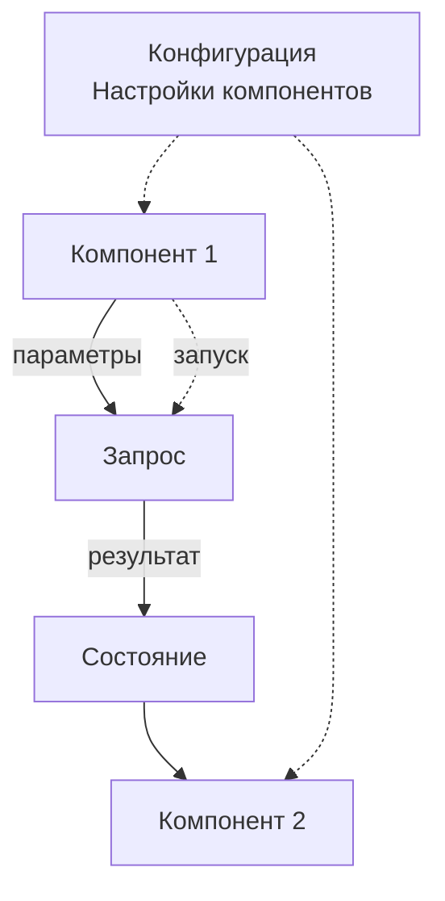

# Метамодель приложения

Метамодель Endge состоит из связанных конфигурационных документов. Вместе они описывают данные, доступные возможности, сценарии их использования и предусмотренные настройки. Разные приложения могут использовать необходимые им части этого описания.

## Основные части

| Часть метамодели | Что описывает |
| --- | --- |
| Данные и типы | Структуру значений, ограничения и контракты обмена |
| Операции и источники данных | Какие возможности вызываются, с какими параметрами и результатами |
| Компоненты | Состав интерфейса, его входы, события и доступные настройки |
| Композиции | Как участники связаны, что передают друг другу и когда выполняют действия |
| Конфигурации | Допустимые настройки, значения по умолчанию и уточнения для контекста |

Например, компонент 1 передаёт параметры запросу. Запрос получает данные от сервиса 1 через подключённый транспорт, а компонент 2 отображает результат. Композиция описывает связи и условие запуска, типы — формат передаваемых значений, конфигурация — предусмотренные настройки.

Сплошные стрелки показывают передачу значений, пунктир — условие запуска и применение настроек. Программные реализации обеспечивают отображение компонентов и обращение к сервису 1; на схеме показан сам конфигурационный сценарий.

## Описание, вариант и исполнение

**Метамодель** задаёт общую основу и допустимые различия. **Конфигурация в контексте** определяет конкретный вариант: например, значения параметров компонента 2. **Runtime** содержит состояние отдельного запуска: полученные данные, текущие значения и активные ресурсы.

Метамодель выражается через документы Endge и их контракты. Это общее понятие для связанного описания, а не отдельный тип сохраняемого документа. Полученные от сервиса данные принадлежат исполнению и не становятся частью исходного описания автоматически.

## Связь с программными реализациями

Разработчики предоставляют компоненты, операции, транспорт и алгоритмы. Метамодель определяет, как использовать эти возможности и какие различия разрешены между вариантами. Новый параметр можно задать через предусмотренную настройку; новая операция требует соответствующей реализации и контракта.

Далее: [как контекст определяет вариант приложения](/product/context). Подробный состав документов — в разделе [«Сущности Endge»](/domain/entities).
