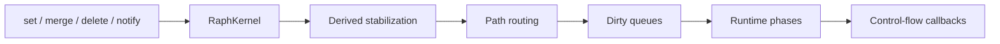

# Поток изменения данных

Изменение shared data проходит через kernel до того, как runtime-фазы и внешние callbacks увидят событие.

## 1. Mutation

`set`, `merge` и `delete` сначала изменяют данные через текущий `DataAdapter`. `notify` не изменяет значение, а публикует факт изменения пути.

Kernel формирует mutation record с исходным и разобранным путём. Внутри `transaction` записи накапливаются; вне transaction обработка начинается сразу.

## 2. Derived stabilization

Если зарегистрированы materialized dependencies, kernel передаёт batch в derived manager. Тот:

- определяет затронутые derived nodes;
- выполняет их в топологическом порядке;
- применяет incremental strategy либо full fallback;
- записывает новые target values;
- добавляет target mutations в итоговый batch.

Обычные observers ещё не вызываются. Поэтому они видят уже стабилизированное состояние source и target.

## 3. Доставка событий

Kernel доставляет каждый стабилизированный event:

- прямым data observers, зарегистрированным через `observeData`;
- каждому runtime lane, чей phase router, node router или control-flow router совпал с путём.

Один shared mutation может пометить dirty ноды сразу в нескольких runtime одного kernel.

## 4. Выполнение фаз

Runtime складывает ноды и их события в dirty queues. Scheduler коалесцирует invalidations и вызывает `run()`. Фазы выполняются в порядке объявления, а ноды внутри фазы — согласно priority strategy.

## 5. Control-flow callbacks

Подписки `subscribe` выполняются после фаз текущего runtime. Callback получает:

- batch `events`;
- первый набор захваченных `params` как sugar;
- полный список `matches`, чтобы не потерять параметры нескольких совпадений.

Такой порядок отделяет стабилизацию data-flow от внешних реакций на её результат.

