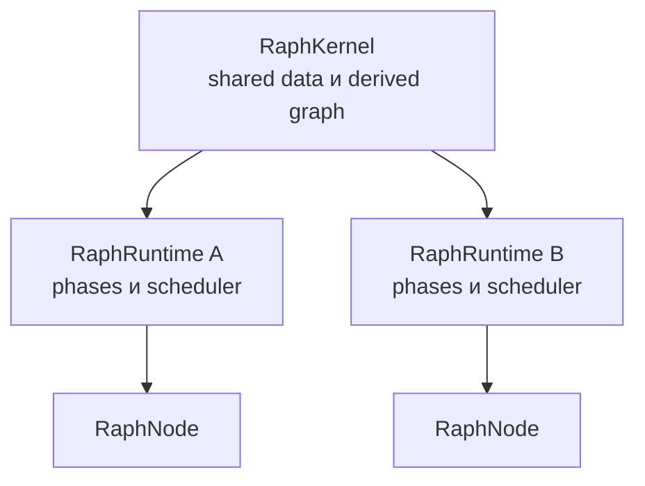

# Kernel, Runtime и Node

Архитектура Raph разделяет владение данными и владение выполнением.



## RaphKernel

`RaphKernel` — source of truth для общих данных. Он владеет:

- `DataAdapter`;
- data observers;
- списком подключённых runtime lanes;
- transaction buffer;
- registry и графом derived dependencies;
- доставкой стабилизированного набора событий в runtime.

Несколько runtime одного kernel читают и изменяют одно хранилище, но не разделяют свои ноды, phases и dirty queues.

## RaphRuntime

`RaphRuntime` — один execution lane. Он владеет:

- dependency graph нод;
- parent/children деревом local runtime;
- фазами и phase router;
- scheduler и frame context;
- dirty queues;
- control-flow subscriptions;
- runtime-specific derived registrations и data observers.

Runtime регистрируется в kernel при создании. `destroy()` снимает его observers и derived registrations, останавливает loop и освобождает ноды.

## RaphApp

`RaphApp` наследует `RaphRuntime` и по умолчанию создаёт собственный `RaphKernel`. Это совместимый самостоятельный runtime:

```ts
import { RaphApp } from '@endge/raph'

const app = new RaphApp({ id: 'preview' })
```

При необходимости `RaphApp` можно подключить к уже существующему kernel через параметр `kernel`.

## RaphNode

`RaphNode` является единицей выполнения. Нода имеет:

- стабильный `id` внутри графа;
- `type`, `weight` и `meta`;
- зависимости в `DepGraph`;
- подписки на data paths;
- parent и children для local runtime;
- local values и dirty state по фазам.

Связь `parent → child`, создаваемая через `addChild`, одновременно добавляет dependency edge. Но произвольная dependency через `addDependency` не обязана означать иерархическое владение.

## Static facade

`Raph` лениво создаёт default `RaphApp` и делегирует ему операции. Static API удобен, но остаётся глобальным process-wide контуром. Для preview, нескольких документов или независимо уничтожаемых runtime предпочтительнее явные instances.

