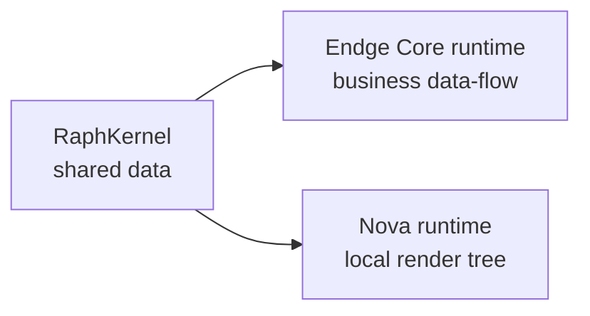

# Raph в Endge Core и Nova

Endge Core и Nova используют разные стороны Raph. Интеграции показывают назначение библиотеки, но не меняют её framework-neutral contract.

## Endge Core

Core использует Raph как runtime infrastructure:

- runtime hosts представлены графовыми нодами;
- Store, Query и DataView публикуют данные через path-based store;
- transactions группируют согласованные изменения;
- derived strategies материализуют Query/Store/DataView outputs;
- phases упорядочивают runtime updates;
- Vue bridges подписываются на уже принадлежащий Core runtime state.

Пользователь Endge обычно работает через декларации Core — Store, Query, DataView, Filter, Update и Composition. Прямые mutations через `Raph` обходят ownership и validation этих сущностей, поэтому не являются публичным способом изменить Endge document.

## Nova

Nova использует Local Runtime для node-based rendering:

- `NovaNode` наследует `RaphNode`;
- decorators описывают local properties и phases;
- propagation распространяет visibility/layout state по дереву;
- frame context используется motion и rendering lifecycle;
- loop leases удерживают непрерывный execution только пока он нужен;
- Nova application может получить внешний `RaphKernel` для синхронизации data-store с другим runtime lane.

Raph при этом не знает о canvas, renderer, hit testing или Nova components. Эти responsibilities остаются в Nova.

## Общая схема

Shared kernel допустим только при реальной потребности в общем data contract. Независимая Nova-сцена может и должна использовать собственный kernel.

## Граница интеграции

- Raph владеет transport-neutral store, routing и execution primitives;
- Core владеет доменными сущностями, validation и document runtime;
- Nova владеет rendering, input, scene lifecycle и visual state;
- application composition решает, должны ли эти owners разделять kernel.

