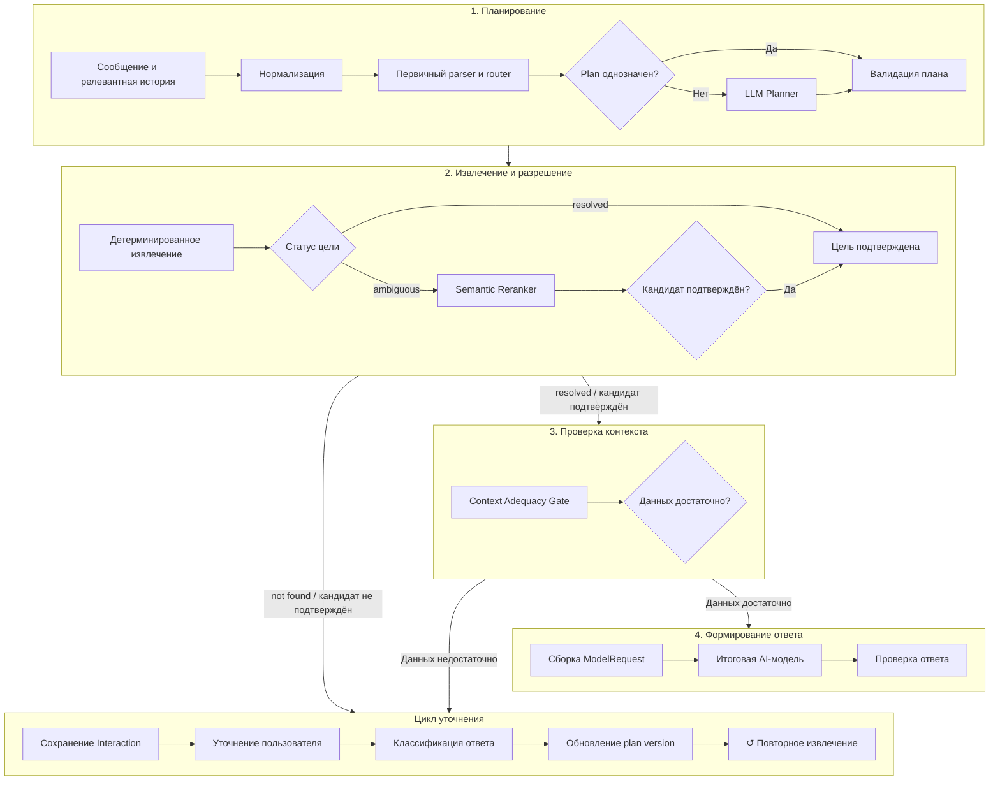

# AI Workbench: подготовка данных

> Статус: целевая схема развития. Отдельные этапы могут ещё не быть реализованы в текущей версии Workbench.

AI Workbench — внутренний сервис Endge, который готовит документацию, снимок Workspace и историю диалога для вызова выбранной AI-модели. Модель не получает нефильтрованный домен: до вызова все цели, сущности и источники проходят проверяемую подготовку.

Детали разнесены по этапам:

1. [Нормализация и план](./stages/normalization-and-planning.md).
2. [Источники и извлечение](./stages/sources-and-retrieval.md).
3. [Разрешение сущностей](./stages/entity-resolution.md).
4. [Цикл уточнений](./stages/clarification-loop.md).
5. [Сборка контекста](./stages/context-assembly.md).
6. [Генерация и проверка](./stages/generation-and-validation.md).

## Главный принцип

Workbench использует **gated hybrid workflow**:

- однозначные операции выполняются детерминированно;
- подготовительный вызов модели разрешён только при неоднозначном естественном языке;
- любой результат модели проходит валидацию по доверенному снимку Workspace;
- количество вызовов модели зависит от сложности запроса, а не от фиксированной цепочки;
- если данных недостаточно, Workbench спрашивает пользователя, а не просит модель додумать отсутствующие факты.

## Общая схема



## 1. Нормализация

Перед классификацией Workbench алгоритмически:

- приводит текст к единой Unicode-форме;
- нормализует регистр, пробелы, пунктуацию и `ё/е`;
- выделяет кавычки, UUID и строки, похожие на identity;
- распознаёт явные перечисления и команды: «найди», «покажи», «сравни», «объясни»;
- отмечает ссылки на историю: «она», «эта композиция», «предыдущая».

## 2. План задач

Запрос делится не по предложениям, а по смысловым задачам. Зависимые задачи образуют направленный граф.

Например, запрос «Найди композицию „Пример Альфа“, покажи её Store и объясни фильтр» превращается в:

```json
{
  "tasks": [
    {
      "id": "t1",
      "intent": "inspect_entity",
      "entityType": "composition",
      "mention": "Пример Альфа",
      "dependsOn": []
    },
    {
      "id": "t2",
      "intent": "trace_relations",
      "relation": "store",
      "dependsOn": ["t1"]
    },
    {
      "id": "t3",
      "intent": "explain_configuration",
      "focus": "filter",
      "dependsOn": ["t1"]
    }
  ]
}
```

Начальный реестр задач:

- `explain_documentation`;
- `find_entity`;
- `inspect_entity`;
- `list_entities`;
- `compare_entities`;
- `trace_relations`;
- `explain_configuration`;
- `diagnose_configuration`;
- `unsupported` — запрос вне текущих возможностей.

## 3. Planner gate

Сначала Workbench пытается построить план детерминированно. LLM Planner вызывается, если в запросе есть:

- несколько связанных задач;
- неявное намерение;
- ссылка на предыдущие реплики;
- низкая уверенность первичного parser.

Planner возвращает только структуру по заданной схеме. Он может выделить intent, тип и текстовое упоминание, но не может объявить найденный domain identity. После Planner план проверяется по реестру допустимых intent, типов и связей.

## 4. Маршрутизация источников

Каждая задача получает `sourceMode`:

| `sourceMode` | Когда используется |
|---|---|
| `documentation` | Общий вопрос о возможностях и синтаксисе Endge. |
| `domain` | Вопрос только о текущем Workspace. |
| `mixed` | Конкретный документ рассматривается с учётом правил из документации. |
| `conversation` | Задача ссылается на ранее разрешённый контекст. |
| `none` | Для ответа не нужны документация и снимок Workspace. |

Выбор `domain` не загружает документацию, а `documentation` не запускает извлечение доменных сущностей.

## 5. Разрешение доменных сущностей

Для каждого упоминания Workbench строит набор кандидатов. Сигналы применяются в порядке убывания надёжности:

1. точное совпадение `documentType + identity`;
2. точное нормализованное `displayName`;
3. алиасы, склонения и транслитерация;
4. совпадение токенов и префиксов;
5. fuzzy-сравнение;
6. упоминание в содержимом документа как слабый дополнительный сигнал.

Результат разрешения:

| Статус | Действие |
|---|---|
| `resolved` | Найден один уверенный кандидат. |
| `ambiguous` | Найдено несколько близких кандидатов. |
| `not_found` | Подходящих сущностей нет. |
| `unsupported_type` | Тип пока не поддержан доменным resolver. |

После выбора цели граф домена используется для добавления только нужных связей. Например, `Folder → Composition → Store/Query/Filter/Component`. Граф расширяет уже разрешённую цель, но не выбирает её.

## 6. Semantic Reranker

Если алгоритм нашёл несколько близких кандидатов, модель может помочь с ранжированием. Она получает только закрытый список кандидатов и может:

- выбрать один из переданных `candidateId`;
- вернуть `none`;
- запросить уточнение.

Модель не может вернуть произвольный identity. Выбранный `candidateId` снова проверяется Workbench.

## 7. Извлечение документации

Поиск по документации остаётся детерминированным. Для сложного вопроса модель может сформировать несколько поисковых выражений, но выбор фрагментов, удаление дублей и распределение бюджета выполняет Workbench.

## 8. Context Adequacy Gate

Перед сборкой итогового запроса Workbench проверяет:

- все ли задачи поддержаны;
- разрешены ли целевые сущности;
- присутствуют ли необходимые связи;
- найдены ли релевантные фрагменты документации;
- не была ли целевая сущность вытеснена бюджетом контекста.

Если проверка не пройдена, Workbench возвращает уточняющий вопрос без вызова итоговой модели.

## 9. Сохранение и продолжение Interaction

Один логический запрос может занять несколько сообщений. Workbench сохраняет его как `Interaction` с неизменяемым исходным сообщением, версионным планом и цепочкой уточнений.

Каждое уточнение привязано к `interactionId`, `taskId`, конкретному незаполненному полю и снимку предложенных кандидатов. Ответ пользователя изменяет только целевую часть плана, после чего зависимые задачи пересчитываются.

Перед продолжением Workbench проверяет, является ли новое сообщение ответом, исправлением, отменой или новым независимым запросом. Полная история не переписывается моделью в новый текст: единый `ModelRequest` собирается как производная проекция из исходного запроса, plan version и сохранённых уточнений.

Полный контракт цикла описан в разделе [«Уточнения»](./stages/clarification-loop.md).

## 10. Контракт итоговой модели

Итоговая модель получает не сырой `ExportLive`, а подготовленный `ModelRequest`:

```json
{
  "originalRequest": "...",
  "tasks": [],
  "resolvedEntities": [],
  "documentationFragments": [],
  "domainRelations": [],
  "conversationContext": [],
  "answerRequirements": {
    "language": "ru",
    "citeEntityIdentities": true,
    "doNotInventMissingData": true
  }
}
```

Модель формулирует связный ответ, но не изменяет план, не добавляет неизвестные источники и не выполняет domain-изменения.

## 11. Проверка ответа

После генерации Workbench алгоритмически проверяет:

- существуют ли упомянутые identity;
- были ли упомянутые документы переданы модели;
- соблюдён ли заданный формат;
- не заявляет ли ответ об изменениях, которые Workbench не выполнял.

## Когда вызывается модель

| Сценарий | Подготовительные вызовы | Итоговый вызов |
|---|---:|---:|
| Точный identity | 0 | 1 |
| Понятный вопрос по документации | 0 | 1 |
| Сложный составной запрос | 1 — Planner | 1 |
| Неоднозначная сущность | 1 — Reranker | 1 |
| Сложный план и неоднозначная сущность | до 2 | 1 |
| Требуется уточнение | 0–2 | 0 |

Несколько независимых задач могут обрабатываться параллельно, но для связного ответа используется один итоговый вызов.

## Инварианты

- Backend остаётся единственной точкой доступа Configurator к Workbench.
- Workbench получает доверенный `ExportLive` и не читает базу Endge.
- AI-модель не объявляет domain identity найденным без проверки Workbench.
- Точно разрешённая цель не вытесняется бюджетом контекста.
- Модель выбирает только из закрытого набора кандидатов.
- Недостаток данных приводит к уточнению, а не к случайному fallback.
- Исходный запрос внутри Interaction неизменяем; каждое уточнение порождает новую версию плана.
- Ответ на уточнение связан с конкретным `clarificationId`, а не угадывается по всей истории.
- Подготовительные циклы имеют жёсткий лимит; Workbench не запускает неограниченный автономный agent loop.
- Мутации домена не входят в этот flow.

## Поэтапное развитие

1. `find_entity`, `inspect_entity` и `list_entities`, включая ограничение папкой.
2. Детерминированные план, resolver и Context Adequacy Gate.
3. LLM Planner для сложных и связанных задач.
4. Semantic Reranker для ограниченного набора кандидатов.
5. `compare_entities`, `trace_relations` и диагностика конфигурации.
6. Каждый новый этап включается только после сравнения с набором размеченных запросов.
