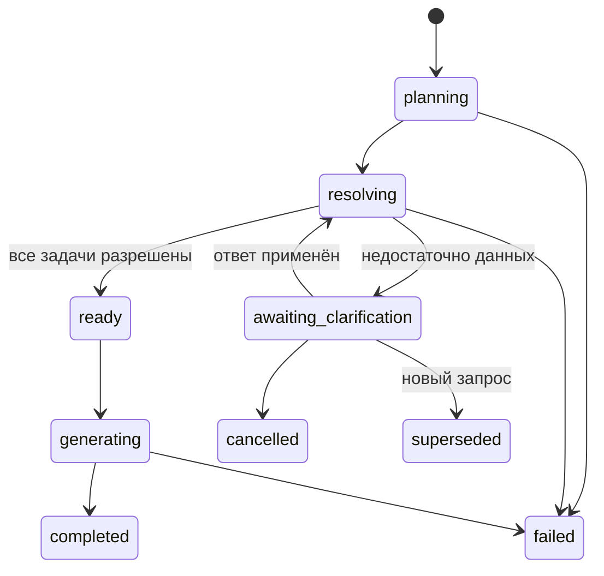

# 4. Цикл уточнений

> Статус: реализовано в Workbench v0.6.0 и additive transport-контракте. Общая схема находится в разделе [«AI Workbench: подготовка данных»](../data-preparation.md).

Уточнение не является новым независимым prompt. Это продолжение сохранённого `Interaction` — одного логического запроса, который может занять несколько сообщений.

## Interaction и Conversation

```text
Conversation
├── Interaction A: completed
├── Interaction B: awaiting_clarification
│   ├── root user message
│   ├── clarification question 1
│   ├── user answer 1
│   ├── clarification question 2
│   └── user answer 2
└── Interaction C: new request
```

Conversation владеет историей диалога. Interaction владеет планом и незавершённой целью. Один transport run может включать ограниченные подготовительные model calls и один итоговый provider call.

## Машина состояний



В первой версии в Conversation допускается не более одного активного Interaction. Новый независимый запрос переводит предыдущий в `superseded`.

## Сохраняемое состояние

Фактическая проекция Interaction:

```text
interactions
  id
  conversation_id
  root_message_id
  status
  plan_json
  plan_version
  workspace_generation
  workspace_snapshot_sha256
  documentation_version
  created_at
  updated_at
```

Цепочка уточнений:

```text
clarifications
  id
  interaction_id
  task_id
  slot
  question_message_id
  answer_message_id
  candidate_snapshot_json
  status
  plan_version
  created_at
  resolved_at
```

Схема добавляется append-only миграцией `000002_interactions.sql`; исходная миграция диалогов не переписывается.

## Формирование вопроса

Вопрос адресует одно незаполненное поле конкретной задачи:

```json
{
  "id": "clarification-7",
  "interactionId": "interaction-42",
  "taskId": "task-1",
  "slot": "entity",
  "question": "Какую сущность вы имеете в виду?",
  "candidates": [
    {
      "candidateId": "c1",
      "identity": "example-composition-alpha",
      "displayName": "Пример композиции Альфа"
    },
    {
      "candidateId": "c2",
      "identity": "example-composition-beta",
      "displayName": "Пример композиции Бета"
    }
  ]
}
```

`candidate_snapshot_json` фиксирует закрытый список, из которого можно принять `selectedCandidateId`, и не позволяет клиенту подставить новый identity. Интерпретация порядковых ответов вроде «первую» отдельным resolver в v0.6.0 не реализована.

## Связь ответа с вопросом

Configurator передаёт скрытую структурную ссылку:

```json
{
  "text": "Первую",
  "interactionId": "interaction-42",
  "replyToClarificationId": "clarification-7"
}
```

При выборе готового кандида UI может передать `selectedCandidateId`. Текстовый ответ тоже сохраняется как обычное user message.

Для streaming-контракта нужен отдельный event `clarification_required`. Он завершает текущий transport run, но не завершает Interaction.

## Классификация ответа

Новая реплика может быть:

- `answer` — ответом на открытый вопрос;
- `correction` — исправлением ранее указанного условия;
- `new_request` — новой независимой задачей;
- `cancel` — отменой Interaction;
- `unclear` — ответ нельзя связать с планом.

Явные команды и candidate click обрабатываются алгоритмически. LLM Clarification Classifier вызывается только для неоднозначного свободного текста. При невалидном или неуверенном результате текст трактуется как ответ и повторно проходит resolution; если он снова неоднозначен, Workbench создаёт следующее уточнение.

## Обновление плана

Ответ применяется как scoped patch:

```json
{
  "interactionId": "interaction-42",
  "basePlanVersion": 3,
  "updates": [
    {
      "taskId": "t1",
      "field": "resolvedEntity",
      "candidateId": "c1"
    }
  ]
}
```

Workbench атомарно:

1. проверяет `basePlanVersion`;
2. проверяет candidate snapshot;
3. связывает уже сохранённый user message с clarification;
4. применяет patch;
5. повышает `plan_version`;
6. инвалидирует зависимые задачи;
7. снова запускает preparation для актуального плана.

Исходный user message остаётся неизменным.

## Изменение Workspace

При каждом продолжении backend передаёт актуальный `ExportLive`. Если snapshot hash изменился, Workbench:

- повторно проверяет уже разрешённые identity;
- повторяет resolution задач, использующих domain context;
- задаёт новое уточнение, если выбранный документ исчез.

Следующий этап: [«Сборка контекста»](./context-assembly.md).
